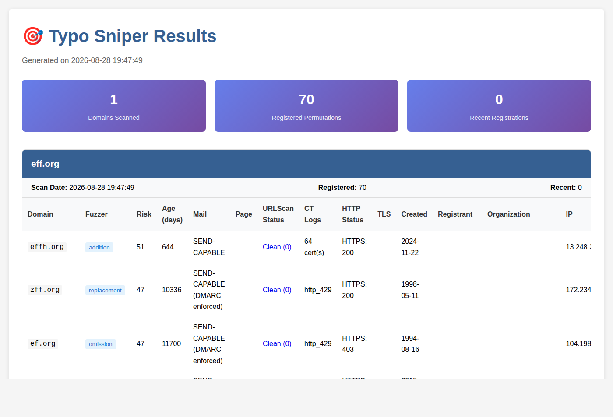

# Typo Sniper

<div align="center">



**Advanced Domain Typosquatting Detection Tool**

[](https://www.python.org/downloads/)
[](https://github.com/ChiefGyk3D/typo-sniper/actions/workflows/ci.yml)
[](https://www.gnu.org/licenses/agpl-3.0)
[](COMMERCIAL.md)
[](https://github.com/chiefgyk3d/typo-sniper)

Detect and monitor typosquatting domains targeting your brand with powerful automation, threat intelligence, and beautiful reporting.

<br/>

---

> ⚠️ **Work in Progress:** Typo Sniper is under active development! Features, output, and documentation may change. Please [report any issues](https://github.com/chiefgyk3d/typo-sniper/issues) you find, and contributions are always welcome—see the [Contributing](#-contributing) section below!

</div>

---

## 📋 Table of Contents

**Quick Navigation:**
- [Documentation Guide](#-documentation-guide)
- [Quick Start](#-quick-start) ⚡ **Start here!**
- [Installation](#-installation)
- [Usage & Examples](#-usage)
- [Configuration](#-configuration)
- [Features](#-features)
- [Output Formats](#-output-formats) 📊 **Includes sample files!**
- [Architecture](#-architecture)
- [Advanced Usage](#-advanced-usage)
- [Troubleshooting](#troubleshooting)
- [Contributing](#-contributing)
- [AI-Assisted Triage](#-ai-assisted-triage) 🤖
- [Page Analysis](#-page-analysis) 🔎
- [Learned Triage Ranking](#-learned-triage-ranking) 🧠
- [Alerting and Ticketing](#-alerting-and-ticketing) 🔔
- [Secrets Management](#-secrets-management) 🔐
- [Testing & Verification](#-testing-and-verification)

---

## 📚 Documentation Guide

**New to Typo Sniper?** Start here:

| Document | Description | When to Use |
|----------|-------------|-------------|

| **[Quick Start Guide](docs/guides/QUICKSTART.md)** | 🚀 **Start here!** 10-minute guide to get running | First time setup, testing features |
| **[README.md](README.md)** | 📖 **You are here.** Complete overview and reference | Understanding features, basic usage |
| **[Enhancements](docs/guides/ENHANCEMENTS.md)** | 🔬 Deep dive into enhanced detection & threat intel | Understanding detection algorithms |
| **[Testing Guide](TESTING.md)** | 🧪 Comprehensive testing guide with API setup | Setting up APIs, troubleshooting |
| **[Debug Mode Guide](docs/guides/DEBUG_MODE.md)** | 🐛 Debug mode and troubleshooting guide | Troubleshooting, understanding what's running |
| **[Secrets Management](docs/guides/SECRETS_MANAGEMENT.md)** | 🔐 Complete secrets management guide | Choosing secrets solution, security |
| **[AI Analysis](docs/guides/AI_ANALYSIS.md)** | 🤖 AI-assisted triage and its injection defences | Enabling `--ai`, choosing a provider |
| **[ML Triage](docs/guides/ML_TRIAGE.md)** | 🧠 Learned ranking from your own decisions | Labelling findings, training a model |
| **[Alerting](docs/guides/ALERTING.md)** | 🔔 Slack, Discord, Teams, Matrix, Jira, webhook, email | Wiring up notifications and tickets |
| **[Docker Guide](docker/DOCKER.md)** | 🐳 Docker deployment guide | Container deployment |
| **[Project Structure](PROJECT_STRUCTURE.md)** | 📁 Project organization details | Contributing, understanding codebase |


> **Note:** Some topics (like secrets management) are now consolidated into this README for easier navigation. Use the table above to jump to the right section or external document.

**Secrets Management Options:**
- **Environment Variables** (easiest for testing)
- **[Doppler](https://doppler.com)** (⭐ recommended for production — needs nothing installed)
- **[HashiCorp Vault](https://www.vaultproject.io/)** (self-hosted — also needs nothing installed)
- **[AWS Secrets Manager](https://aws.amazon.com/secrets-manager/)** (AWS environments)
- **[Azure Key Vault](https://azure.microsoft.com/products/key-vault)** (Azure environments)
- **[Google Cloud Secret Manager](https://cloud.google.com/secret-manager)** (GCP environments)
- **[1Password](https://developer.1password.com/docs/cli/)** (via the `op` CLI)
- **Config files** (development only - never commit!)

Run `typo-sniper --secrets-check` to see which backends are
reachable and where each credential resolved from. It never prints a value.

See **[Secrets Management](#-secrets-management)** for detailed comparisons and setup guides.

---

## ⚡ Quick Start

### 1️⃣ Install

```bash
pip install typo-sniper
```

Or from a clone, which is what you want if you plan to change anything:

```bash
git clone https://github.com/chiefgyk3d/typo-sniper.git
cd typo-sniper
pip install -e .
```

Either way you get a `typo-sniper` command. Optional features are extras —
`pip install "typo-sniper[claude]"` for AI triage, `[ml]` to train the ranking
model, `[aws]`/`[azure]`/`[gcp]` for those secrets backends, or `[all]`.

There is also a container image:

```bash
docker run --rm ghcr.io/chiefgyk3d/typo-sniper:latest --version
```

> **Note:** `dnspython` is required, not optional. Without it dnstwist silently
> falls back to socket lookups — no MX or NS records are collected and more
> permutations come back unresolvable. It is pinned in `requirements.txt`.

### 2️⃣ Create Domain List

```bash
echo "example.com" > test_domains.txt
```

### 3️⃣ Run Basic Scan

```bash
typo-sniper -i test_domains.txt --format excel
```

### 4️⃣ View Results

```bash
# Results are in results/ directory
ls -lh results/
xdg-open results/typo_sniper_results_*.xlsx
```

> 💡 **Sample Output:** The `results/` directory includes sample output files (`sample.json`, `sample.csv`, `sample.html`, `sample.xlsx`) generated from scanning `eff.org`. These demonstrate what a real scan produces across all output formats.

**Want threat intelligence?** See [TESTING.md](TESTING.md) for API setup.

### 5️⃣ Run the Tests (optional)

```bash
pip install -r requirements-dev.txt
pytest              # unit tests, no network required
ruff check src/ tests/
```

**[⬆ Back to Top](#-table-of-contents)**

---

## Project Structure

```
typo-sniper/
├── src/                           # Core Python source code
│   ├── __init__.py                # Package initialization
│   ├── cache.py                   # Caching system
│   ├── config.py                  # Configuration management
│   ├── exporters.py               # Output format exporters (Excel, JSON, CSV, HTML)
│   ├── scanner.py                 # Domain scanning & WHOIS enrichment
│   ├── enhanced_detection.py      # 🆕 Advanced detection algorithms
│   ├── threat_intelligence.py     # 🆕 Threat intel integrations
│   ├── secrets_manager.py         # 🆕 Secrets management
│   └── typo_sniper/              # The installable package
│       ├── cli.py                # Application & CLI entry point
│   ├── utils.py                   # Utility functions
│   └── monitored_domains.txt      # Example domain list
├── docker/                        # Docker-related files
│   ├── Dockerfile                 # Standard Docker image
│   ├── Dockerfile.doppler         # 🆕 Docker with Doppler support
│   ├── docker-compose.yml         # Docker Compose configuration
│   ├── docker-compose.threat-intel.yml  # 🆕 Compose with threat intel
│   ├── .dockerignore              # Docker build exclusions
│   ├── .env.example               # 🆕 Environment variables template
│   └── DOCKER.md                  # Docker usage guide
├── tests/                         # Unit tests
│   └── __init__.py                # Test package initialization
├── docs/                          # Documentation & configs
│   ├── LICENSE                    # GNU AGPL v3
│   └── config.yaml.example        # Example configuration
├── QUICKSTART.md                  # 🆕 Quick start guide (start here!)
├── TESTING.md                     # 🆕 Testing & API setup guide
<!-- SECRETS_MANAGEMENT.md has been removed from the project structure -->
├── ENHANCEMENTS.md                # 🆕 Feature documentation
├── PROJECT_STRUCTURE.md           # Project organization
├── requirements.txt               # Python dependencies
├── .gitignore                     # Git ignore rules
└── README.md                      # This file
```

**[⬆ Back to Top](#-table-of-contents)**

---

## 🎯 Features

### Core Capabilities
- **Comprehensive Detection** - Uses [dnstwist](https://github.com/elceef/dnstwist) for industry-leading typosquatting detection
- **Rich WHOIS Data** - Automatically enriches results with detailed WHOIS information
- **Async & Parallel** - Fast concurrent scanning with configurable worker pools
- **Smart Caching** - Avoid redundant WHOIS lookups with built-in caching
- **Date Filtering** - Focus on recently registered domains
- **Multiple Formats** - Export to Excel, JSON, CSV, and HTML

### Enhanced Detection Methods (Optional)
> 
>
> *"ENHANCE!" — Just like in the movies, but with more DNS lookups. Use enhanced detection with caution!*
- **Combo-Squatting** - Detects domains combining your brand with popular keywords (e.g., `example-shop.com`, `secure-example.com`)
  - 50+ keywords: login, secure, account, shop, store, support, admin, payment, verify, etc.
  - Multiple separators: hyphens, underscores, numbers
  - Configurable via `enable_combosquatting` setting

- **Sound-Alike Detection** - Finds domains that sound phonetically similar using Soundex and Metaphone algorithms
  - Example: `example.com` → `exampul.com`, `egzample.com`
  - Configurable via `enable_soundalike` setting

- **IDN Homograph Detection** - Identifies internationalized domain names using confusable Unicode characters
  - Example: `example.com` → `еxample.com` (Cyrillic 'е'), `exаmple.com` (Cyrillic 'а')
  - Detects mixed-script attacks using lookalike characters
  - Configurable via `enable_idn_homograph` setting

### Threat Intelligence Integration (Optional)
- **URLScan.io** - Analyze live website behavior and security posture
  - **Auto-enables when API key is configured** (no additional flags needed!)
  - Requires API key (free tier available at [urlscan.io](https://urlscan.io))
  - Smart scanning: checks for existing scans first, only submits new scan if older than `urlscan_max_age_days` (default: 7 days)
  - Waits up to `urlscan_wait_timeout` seconds (default: 90s) for scan results
  - Provides verdict: malicious, suspicious, clean with threat scores and categories
  - Returns screenshot URL and report URL for further investigation
  - Can be explicitly disabled with `ENABLE_URLSCAN=false` environment variable if needed
  - Configurable via `urlscan_api_key`, `urlscan_max_age_days`, `urlscan_wait_timeout`, and `urlscan_visibility`

- **Certificate Transparency Logs** - Monitor SSL/TLS certificate issuance
  - Tracks certificate history for domains
  - No API key required
  - Configurable via `enable_certificate_transparency`

- **HTTP Probing** - Test if domains are actively hosting content
  - Checks HTTP/HTTPS status codes
  - Configurable timeout (default: 10s)
  - Configurable via `enable_http_probe` and `http_timeout`

- **Risk Scoring** - Automated threat assessment (0-100 scale)
  - Combines threat intelligence signals
  - Color-coded in Excel reports (Red: 70+, Orange: 50-69, Yellow: 30-49)
  - Configurable via `enable_risk_scoring`

### Key Features
- Complete with modern Python async/await
- Modular, object-oriented architecture
- Beautiful CLI with progress bars and colored output
- Enhanced Excel reports with multiple sheets and rich formatting
- Stunning HTML reports with responsive design
- YAML-based configuration system
- Intelligent retry logic and error handling
- Comprehensive logging with Rich integration
- Significant performance improvements

**[⬆ Back to Top](#-table-of-contents)**

---

## 🚀 Installation

### Docker (Recommended)

The easiest way to run Typo Sniper is using Docker:

```bash
# Clone the repository
git clone https://github.com/chiefgyk3d/typo-sniper.git
cd typo-sniper


# Build the Docker image
docker build -f docker/Dockerfile -t typo-sniper:1.1.0 .

# Run a scan
docker run --rm \
  -v "$(pwd)/src/typo_sniper/monitored_domains.txt:/app/data/domains.txt:ro" \
  -v "$(pwd)/results:/app/results" \
  typo-sniper:1.1.0 \
  -i /app/data/domains.txt \
  --format excel json
```

See [docker/DOCKER.md](docker/DOCKER.md) for comprehensive Docker usage guide.

### Standard Installation

### Prerequisites
- Python 3.8 or higher
- pip package manager

### Quick Install

```bash
# Clone the repository
git clone https://github.com/chiefgyk3d/typo-sniper.git
cd typo-sniper

# Install dependencies
pip install -r requirements.txt
```

### Security Note: Pinned Dependencies

All dependencies are **pinned to specific versions** in `requirements.txt` to protect against supply chain attacks like [Shai-Hulud](https://www.crowdstrike.com/blog/shai-hulud-suspicious-pypi-packages/) and other compromised library incidents. These versions have been verified as secure at the time of release.

**Why we pin versions:**
- Prevents automatic installation of potentially compromised newer versions
- Ensures reproducible builds and consistent behavior
- Versions are tested and verified to work together
- Makes security audits easier and more reliable

**If you want to experiment with newer versions:**
```bash
# Create a test environment
python3 -m venv test-env
source test-env/bin/activate

# Install with newer versions (at your own risk)
pip install --upgrade dnstwist python-whois PyYAML openpyxl rich aiofiles

# Test thoroughly before using in production
typo-sniper --help
```

**Recommended practice:** Review the changelog and security advisories before upgrading any dependency.

### Using Virtual Environment (Recommended)

```bash
# Create virtual environment
python3 -m venv venv

# Activate virtual environment
# On Linux/Mac:
source venv/bin/activate
# On Windows:
# venv\Scripts\activate

# Install dependencies
pip install -r requirements.txt
```

**[⬆ Back to Top](#-table-of-contents)**

---

## 📖 Usage

### Command-Line Interface

```bash
typo-sniper [OPTIONS]
```

### Options

| Option | Description | Default |
|--------|-------------|---------|
| `-i, --input FILE` | Input file with domains to monitor | `monitored_domains.txt` |
| `-o, --output DIR` | Output directory for results | `results/` |
| `--format FORMAT [FORMAT ...]` | Output formats (excel, json, csv, html) | `excel` |
| `--months N` | Filter domains registered in last N months (0 = no filter) | `0` |
| `--config FILE` | Path to YAML configuration file | None |
| `--max-workers N` | Maximum concurrent workers | `10` |
| `--cache-ttl SECONDS` | Cache TTL in seconds | `86400` (24h) |
| `--no-cache` | Disable caching | False |
| `-v, --verbose` | Enable verbose output (INFO level) | False |
| `--debug` | Enable debug output (DEBUG level with tracing) | False |
| `--version` | Show version and exit | - |

### Examples

#### Basic Scan
```bash
# Scan domains from default file
typo-sniper

# Scan with custom input file
typo-sniper -i src/my_domains.txt
```

#### Filter by Registration Date
```bash
# Domains registered in last 1 month
typo-sniper --months 1

# Domains registered in last 6 months
typo-sniper --months 6
```

#### Multiple Export Formats
```bash
# Export to Excel and JSON
typo-sniper --format excel json

# Export to all formats
typo-sniper --format excel json csv html
```

#### Performance Tuning
```bash
# Increase concurrent workers for faster scanning
typo-sniper --max-workers 20

# Disable cache for fresh data
typo-sniper --no-cache

# Longer cache TTL (1 week)
typo-sniper --cache-ttl 604800
```

#### Custom Configuration
```bash
# Use custom config file
typo-sniper --config docs/my_config.yaml
```

#### Verbose Mode
```bash
# Enable verbose logging (INFO level)
typo-sniper -v

# Enable debug logging (DEBUG level with detailed tracing)
typo-sniper --debug
```

> 💡 **Tip:** Use `--debug` to troubleshoot issues like "why am I getting 0 enhanced detections?" It will show you which features are enabled/disabled. See [DEBUG_MODE.md](DEBUG_MODE.md) for details.

**[⬆ Back to Top](#-table-of-contents)**

---

## ⚙️ Configuration

Typo Sniper can be configured using a YAML file. Copy the example configuration:

```bash
cp config.yaml.example config.yaml
```

### Configuration Options

```yaml
# Performance settings
max_workers: 10                    # Concurrent workers
rate_limit_delay: 1.0              # Delay between batches (seconds)

# Cache settings
use_cache: true                    # Enable caching
cache_dir: ~/.typo_sniper/cache    # Cache location
cache_ttl: 86400                   # Cache TTL (24 hours)

# Filter settings
months_filter: 0                   # Registration date filter (0 = disabled)

# dnstwist settings
dnstwist_threads: 20               # dnstwist thread count
dnstwist_mxcheck: true             # Check MX records
dnstwist_phash: false              # Perceptual hashing (requires ssdeep)

# Output settings
output_dir: results                # Output directory

# WHOIS settings
whois_timeout: 30                  # Query timeout
whois_retry_count: 3               # Retry attempts
whois_retry_delay: 5               # Retry delay

# Enhanced Detection (Optional - WARNING: Can significantly slow scans!)
enable_combosquatting: false       # Detect brand+keyword combinations (~360+ variations/domain)
enable_soundalike: false           # Detect phonetically similar domains
enable_idn_homograph: false        # Detect IDN homograph attacks (up to 50 variations/domain)

# Threat Intelligence (Optional)
enable_urlscan: false              # Check URLScan.io analysis
urlscan_api_key: ""                # URLScan.io API key (required if enabled)

enable_certificate_transparency: false  # Check CT logs
enable_http_probe: false           # Probe HTTP/HTTPS endpoints
http_timeout: 10                   # HTTP probe timeout (seconds)

enable_risk_scoring: false         # Calculate risk scores (0-100)
```

### Enhanced Detection Examples

#### Combo-Squatting Detection
Finds domains combining your brand with popular keywords:
```bash
# Enable combo-squatting in config.yaml
enable_combosquatting: true

# Results might include:
example-login.com
secure-example.com
example-shop.net
myexample-support.com
```

#### Sound-Alike Detection
Finds phonetically similar domains:
```bash
# Enable sound-alike in config.yaml
enable_soundalike: true

# Results might include:
exampul.com      # Soundex match
egzample.com     # Metaphone match
exampel.com      # Phonetic variation
```

#### IDN Homograph Detection
Finds Unicode lookalike domains:
```bash
# Enable IDN homograph in config.yaml
enable_idn_homograph: true

# Results might include:
еxample.com      # Cyrillic 'е' instead of 'e'
exаmple.com      # Cyrillic 'а' instead of 'a'
ехаmple.com      # Multiple Cyrillic characters
```

### Threat Intelligence Examples

#### URLScan.io Integration
```yaml
# Enable URLScan in config.yaml
enable_urlscan: true
urlscan_api_key: "your_api_key_here"
urlscan_max_age_days: 7  # Submit new scan if existing scan is older than 7 days
urlscan_wait_timeout: 90  # Wait up to 90 seconds for new scan results

# Get free API key at: https://urlscan.io/user/signup
# Free tier: 5,000 scans/month
```

**Smart Scanning Behavior:**
- Checks for existing scans first
- Only submits new scan if no recent scan exists (older than `urlscan_max_age_days`)
- Waits for and retrieves results from new scans
- Uses cached results when available to save API quota

Results include:
- Verdict: malicious, suspicious, or clean
- Screenshot availability
- Technology stack detected
- Scan age (to see how fresh the data is)

#### Certificate Transparency Monitoring
```yaml
# Enable CT logs (no API key required)
enable_certificate_transparency: true
```

Results include:
- Number of certificates issued
- Certificate authorities used
- Issuance timeline

#### HTTP Probing
```yaml
# Enable HTTP probing
enable_http_probe: true
http_timeout: 10  # seconds
```

Results include:
- HTTP/HTTPS status codes
- Redirect chains
- Active/inactive status

#### Risk Scoring
```yaml
# Enable automated risk scoring
enable_risk_scoring: true
```

Risk scores (0-100) are calculated based on:
- URLScan malicious verdict (+25 points)
- Recent registration (+15 points)
- Active HTTP endpoint (+10 points)
- Certificate transparency presence (+5 points)

**Excel Color Coding:**
- 🔴 Red (70-100): High risk - immediate investigation
- 🟠 Orange (50-69): Medium risk - monitor closely
- 🟡 Yellow (30-49): Low-medium risk - routine review
- ⚪ White (0-29): Low risk

**[⬆ Back to Top](#-table-of-contents)**

---

## 📊 Output Formats

### Excel (.xlsx)
- **Summary Sheet** - Overview of all scanned domains
- **Details Sheet** - Complete permutation data with WHOIS info
- **Statistics Sheet** - Scan statistics and fuzzer distribution
- Rich formatting with colors, fonts, and highlighting
- Auto-adjusted column widths
- Frozen header rows

### JSON (.json)
- Structured data format
- Easy to parse programmatically
- Includes metadata and timestamps
- Perfect for automation and APIs

### CSV (.csv)
- Simple comma-separated values
- Compatible with all spreadsheet tools
- One row per permutation
- All WHOIS and DNS data included

### HTML (.html)
- Beautiful, responsive design
- Interactive tables
- Summary statistics cards
- Recent registrations highlighted
- Print-friendly layout
- No external dependencies

### Sample Output Files

The repository includes sample output files in the `results/` directory:
- `sample.json` - JSON format example (121KB, 71 domain permutations)
- `sample.csv` - CSV format example (29KB)
- `sample.html` - HTML report example (28KB) - see screenshot below
- `sample.xlsx` - Excel workbook example (18KB)

These samples were generated from scanning `eff.org` and show what a typical scan produces.

**HTML Report Screenshot:**


*Interactive HTML report showing domain permutations, WHOIS data, and summary statistics*

**[⬆ Back to Top](#-table-of-contents)**

---

## 🏗️ Architecture

Typo Sniper follows a modular architecture:

```
typo-sniper/
├── src/                    # Core Python source code
│   ├── __init__.py         # Package initialization
│   ├── cache.py            # Caching system
│   ├── config.py           # Configuration management
│   ├── exporters.py        # Output format exporters
│   ├── scanner.py          # Domain scanning & WHOIS enrichment
│   └── typo_sniper/       # The installable package
│       ├── cli.py         # Application & CLI entry point
│   ├── utils.py            # Utility functions
│   └── monitored_domains.txt # Domain list
├── docker/                 # Docker-related files
│   ├── Dockerfile          # Docker image definition
│   ├── docker-compose.yml  # Docker Compose configuration
│   ├── .dockerignore       # Docker build exclusions
│   └── DOCKER.md           # Docker usage guide
├── tests/                  # Unit tests
│   └── __init__.py         # Test package initialization
├── docs/                   # Documentation
│   ├── LICENSE             # GNU AGPL v3
│   └── config.yaml.example # Example configuration
├── requirements.txt        # Python dependencies
├── .gitignore              # Git ignore rules
└── README.md               # Main project README
```

### Key Components

- **TypoSniper** - Main orchestrator class
- **DomainScanner** - Handles domain permutation and WHOIS lookups
- **Cache** - File-based caching system with TTL
- **Exporters** - Pluggable export system (Excel, JSON, CSV, HTML)
- **Config** - YAML-based configuration with dataclasses

---

## How It Works

1. **Load Domains** - Read domains from input file
2. **Generate Permutations** - Use dnstwist to create typosquatting variants
3. **Check Registration** - Identify registered domains via DNS
4. **Enrich with WHOIS** - Fetch detailed WHOIS data (with caching)
5. **Filter Results** - Apply date filters if configured
6. **Export Results** - Generate reports in requested formats

### Fuzzer Types

Typo Sniper uses multiple fuzzing techniques:
- Character addition/omission
- Character repetition/replacement
- Character transposition
- Homoglyph substitution
- Hyphenation variants
- Vowel swapping
- TLD variations
- Bitsquatting
- And more...

---

## Use Cases

### Brand Protection
Monitor for typosquatting domains that could:
- Phish your customers
- Damage your brand reputation
- Steal traffic
- Distribute malware

### Security Operations
- Identify newly registered lookalike domains
- Track suspicious domain patterns
- Generate IOCs for threat intelligence
- Automate domain monitoring workflows

### Research & Analysis
- Study typosquatting trends
- Analyze domain registration patterns
- Research homoglyph abuse
- Investigate cybersquatting

**[⬆ Back to Top](#-table-of-contents)**

---

## 🔧 Advanced Usage

### Automation with Cron

```bash
# Run daily at 2 AM
0 2 * * * cd /path/to/typo-sniper && typo-sniper --months 1
```

### Integration with Other Tools

```python
# Use as a Python module
import sys
sys.path.append('/path/to/typo-sniper/src')

from typo_sniper import Config, DomainScanner, Cache
import asyncio

async def scan_domain(domain):
    config = Config()
    cache = Cache(config.cache_dir)
    scanner = DomainScanner(config, cache)
    
    result = await scanner.scan_domain(domain)
    return result

# Run scan
result = asyncio.run(scan_domain("example.com"))
print(f"Found {len(result['permutations'])} registered permutations")
```

### Cache Management

```python
from cache import Cache
from pathlib import Path

cache = Cache(Path.home() / '.typo_sniper' / 'cache')

# Get cache statistics
stats = cache.get_stats()
print(f"Cache entries: {stats['total_entries']}")
print(f"Cache size: {stats['total_size_mb']} MB")

# Clear expired entries
expired = cache.clear_expired()
print(f"Cleared {expired} expired entries")

# Clear all cache
cache.clear()
```

---

## Troubleshooting

### Common Issues

**Issue: "Module not found" errors**
```bash
# Solution: Ensure all dependencies are installed
pip install -r requirements.txt
```

**Issue: WHOIS lookups timing out**
```bash
# Solution: Increase timeout or reduce workers
typo-sniper --whois-timeout 60 --max-workers 5
```

**Issue: Rate limiting errors**
```bash
# Solution: Reduce concurrent workers and enable delays
typo-sniper --max-workers 5 --rate-limit-delay 2
```

**Issue: Cache directory permission errors**
```bash
# Solution: Change cache directory
typo-sniper --config config.yaml
# Edit config.yaml and set cache_dir to writable location
```

**[⬆ Back to Top](#-table-of-contents)**

---

## 🚀 Future Enhancements

The following features are planned for future releases:

### Serverless Deployment
- **AWS Lambda Integration** - Deploy as serverless function with Terraform
- **Automated IOC Export** - Direct integration with threat intelligence platforms
- **Scheduled Scanning** - Automated periodic domain monitoring via cloud events

### Enterprise Integration
- **CrowdStrike Foundry Module** - Native integration when CrowdStrike is available
- **IOC Feed Generation** - Export results as structured IOCs for SIEM/EDR ingestion
- **API Endpoints** - RESTful API for programmatic access and automation

### Infrastructure as Code
- **Terraform Modules** - Complete AWS deployment automation
- **CloudWatch Integration** - Alerting and monitoring capabilities
- **S3 Result Storage** - Scalable cloud-based result archival

Contributions and feedback on these planned features are welcome!

**[⬆ Back to Top](#-table-of-contents)**

---

## 🤝 Contributing

Contributions are welcome! Please feel free to:
- Report bugs
- Suggest features
- Submit pull requests
- Improve documentation

This project is committed to remaining open source under the GNU AGPL v3, so the core stays free and improvements to it stay public.

---

## License

This project is dual-licensed:

- **[GNU AGPL v3](LICENSE)** for everyone — free to use, modify, and run.
- **[Commercial licence](COMMERCIAL.md)** for organisations embedding Typo Sniper
  in a proprietary product or offering it as a hosted service without publishing
  their modifications.

**Why AGPL v3?** Using Typo Sniper is unrestricted: run it, modify it, and keep
those changes private, in any organisation, commercially, for as long as you like.
The obligation only applies if you *distribute* it or offer a *modified version to
others over a network* — the one case a permissive licence would give away, since
the most likely commercial use of brand-protection tooling is wrapping it in a
hosted service. Security teams monitoring their own brands are unaffected. If the
AGPL does not fit your situation, a [commercial licence](COMMERCIAL.md) is available.

---

## Acknowledgments

- **[dnstwist](https://github.com/elceef/dnstwist)** - The excellent typosquatting detection engine
- **[python-whois](https://github.com/richardpenman/whois)** - WHOIS parsing library
- **[Rich](https://github.com/Textualize/rich)** - Beautiful terminal formatting
- **[OpenPyXL](https://openpyxl.readthedocs.io/)** - Excel file generation

---

## Contact

**Author:** chiefgyk3d

**Version:** 1.1.0

**Repository:** https://github.com/chiefgyk3d/typo-sniper

---

<div align="center">

Made for brand protection and security research

**[Back to Top](#typo-sniper)**

</div>

**[⬆ Back to Top](#-table-of-contents)**

---

## 🤖 AI-Assisted Triage

Optional, off by default, and strictly additive. A scan of a well-known brand
returns hundreds of registered permutations; risk scores rank them but do not
explain them. `--ai` reads the signals together and says what they suggest
about intent, which findings are load-bearing, and what the next step is.

```bash
export ANTHROPIC_API_KEY="sk-ant-..."
typo-sniper -i domains.txt --ai

# Or keep every request on your own host
typo-sniper -i domains.txt --ai-provider ollama
```

| Provider | Install | Default model |
|---|---|---|
| `claude` | `pip install -e ".[claude]"` | `claude-opus-5` |
| `openai` | `pip install -e ".[openai]"` | `gpt-4o` |
| `gemini` | `pip install -e ".[gemini]"` | `gemini-2.0-flash` |
| `ollama` | nothing | `llama3.1` |

**The model explains. It never scores.** Risk scores are computed
deterministically and are identical with AI off, because a takedown request to
a registrar has to rest on reproducible evidence. The response schema has no
score field at all.

**Scan data is treated as hostile input.** The domain name, WHOIS registrant,
organisation, and page title were all written by the person who registered the
domain, and a registrant field is a free text box. Untrusted values never enter
the system prompt, are fenced inside delimiters the data cannot reproduce, are
stripped and truncated, and are schema-constrained; assessments naming domains
that were not in the request are discarded. An injection attempt is **marked,
not deleted** — a registrant field carrying an instruction aimed at an
automated analyst is itself evidence of intent.

**Ollama is a first-class option.** A scan's output names the domains an
organisation is defending, which reveals what they own and what they are
worried about. For teams that cannot send that to a third party, a local model
is the difference between using this feature and disabling it.

See **[AI Analysis](docs/guides/AI_ANALYSIS.md)** for the full guide.

**[⬆ Back to Top](#-table-of-contents)**

---

## 🔎 Page Analysis

A registered lookalike tells you someone bought a domain. A lookalike serving a
form with a password field tells you **what they bought it for**.

On by default, and it costs no extra request — the HTTP probe already reads the
page body to pull out `<title>`, so this reads the same bytes:

| Signal | Why it matters |
|---|---|
| Credential form | Username/email paired with a password field — the phishing kit itself |
| Password field | Present even without a matching username field |
| Off-site form action | A form on `examp1e.com` POSTing to `collector.evil.test` is exfiltration, not login |
| Brand mentioned | Only counted alongside something that collects |
| Form count | Context for the above |

A `type="text"` field named `passwd`, `otp`, `cvv`, or `card_number` counts —
changing the input type is a one-character edit, and the name gives the intent
away. Off-site comparison is by registrable domain via the Public Suffix List,
so `login.examp1e.com` is correctly *not* flagged.

**A credential form appearing raises an `ESCALATED` change.** That transition —
a parked lookalike becoming a live collection point — is the most actionable
thing this tool reports, and it is persisted in scan history so the diff engine
can catch it between runs.

Parsing uses the standard library's `HTMLParser` rather than a third-party
parser. This is attacker-authored markup by definition, so the smaller and more
boring the parsing surface, the better: no external entity resolution, no
network fetches, no recovery heuristics that could be steered. Every collection
is bounded, because a page designed to be parsed slowly is a cheap way to stall
a scan. A page that breaks the parser is reported as **truncated** rather than
as a clean reading — "no password field found" and "we stopped looking" are
different claims.

**[⬆ Back to Top](#-table-of-contents)**

---

## 🧠 Learned Triage Ranking

Optional, off by default, additive. The risk score orders findings by a formula
that is the same for everyone — but teams differ in what they act on. A bank
cares most about mail capability; a consumer SaaS cares most about a cloned
login page. This learns that difference from your own decisions.

```bash
# Label as you triage — "dismissed" matters as much as "acted"
typo-sniper --label secure-example-login.com=acted
typo-sniper --label example-fanclub.com=dismissed

typo-sniper -i domains.txt --ml-status   # where am I?
typo-sniper -i domains.txt --ml-train    # needs .[ml]
typo-sniper -i domains.txt --ml-rank     # order by the model
```

**The model ranks. It does not score.** Risk scores are unchanged with this on,
and remain the number cited in takedown requests — the same rule the AI layer
follows, for the same reason: a registrar can check "registered nine days ago,
valid SPF and DKIM, serving a login page." It cannot check "our model put it
first."

**Training needs scikit-learn. Scoring does not.** A trained model is JSON —
feature names, weights, intercept, standardisation constants — and the scorer
is a dot product in pure Python. So scanning hosts install nothing, the model
is readable enough to audit ("`mail_posture` carries +1.2"), and **nothing is
ever unpickled**. `pickle.load` on a model file is arbitrary code execution,
and model files get emailed around. That is why this is logistic regression
rather than a boosted ensemble that might score a point or two higher.

**Training refuses below 30 labels and 8 of each class.** Below that a model
fits noise, and a confidently wrong ranking is worse than none because it looks
like signal.

**Features come from the earliest snapshot of a domain, not the newest.** A
domain you had taken down resolves nowhere today; training on its current state
would teach the model that dead domains are the dangerous ones — an inversion
learned from perfectly good labels.

See **[ML Triage](docs/guides/ML_TRIAGE.md)** for the full guide.

**[⬆ Back to Top](#-table-of-contents)**

---

## 🔔 Alerting and Ticketing

Alerts fire on **changes**, never on the full result set. A daily scan that
re-reported the same seventy lookalikes every morning gets ignored within a
week; one that says "a new lookalike appeared three days ago and it has MX
records" gets read.

```bash
typo-sniper -i domains.txt --notify slack jira
```

| Channel | What it does |
|---|---|
| `slack` / `discord` | Block Kit message / severity-coloured embed |
| `teams` | Adaptive Card via a Power Automate workflow |
| `matrix` | Room message via the client-server API, no SDK |
| `jira` | **One deduplicated ticket per domain** |
| `webhook` / `email` | Raw JSON to any endpoint / SMTP |

**Jira is ticketing, not alerting, and that changes the design.** A message is
disposable; a ticket is state. A scheduled scan that opened a fresh ticket for
the same lookalike every morning would bury a queue within a week. So it files
**one issue per domain**, deduplicated by a deterministic label, and **caps
creation per run** — the first scan of a well-known brand can surface hundreds
of lookalikes, and turning that into hundreds of tickets would be the most
destructive thing this tool could do to your backlog. What the cap drops is
logged and stays in the report.

**Teams uses Power Automate**, not the retired Office 365 connector. **Matrix
sends its token as a bearer header**, never the deprecated `?access_token=`
query parameter that would land in the homeserver's request logs.

Chat channels strip the markup characters a registrant could use to forge
formatting or embed a link in your Slack channel. The `webhook` channel
deliberately does not: its consumer is a machine, and a domain name is the
primary key it correlates on.

See **[Alerting](docs/guides/ALERTING.md)** for the full guide.

**[⬆ Back to Top](#-table-of-contents)**

---

## 🔐 Secrets Management

<details>
<summary><strong>Table of Contents</strong> (click to expand)</summary>

- [Quick Comparison](#quick-comparison)
- [Priority Order](#priority-order)
- [Detailed Comparison](#detailed-comparison)
  - [Environment Variables](#1-environment-variables)
  - [Config Files](#2-config-files)
  - [Doppler (Recommended for Production)](#3-doppler-recommended-for-production)
  - [AWS Secrets Manager](#4-aws-secrets-manager)
- [Recommendations by Use Case](#recommendations-by-use-case)
- [Security Best Practices](#security-best-practices)
- [.gitignore Requirements](#gitignore-requirements)
- [Migration Guide](#migration-guide)
- [Troubleshooting Secrets](#troubleshooting-secrets)
- [Additional Resources](#additional-resources)
- [Summary Table](#summary-table)

</details>

---

### Secrets Management Options for Typo Sniper

Typo Sniper supports multiple methods for managing API keys and secrets. Choose the option that best fits your environment and security requirements.

### Quick Comparison

| Method | Best For | Security | Setup Time | Cost |
|--------|----------|----------|------------|------|
| **Environment Variables** | Local testing, simple deployments | ⭐⭐ | 1 min | Free |
| **Config Files** | Development only | ⭐ | 2 min | Free |
| **Doppler** | Production, multi-environment | ⭐⭐⭐⭐⭐ | 10 min | Free tier available |
| **AWS Secrets Manager** | AWS-hosted applications | ⭐⭐⭐⭐ | 15 min | ~$0.50/month |

### Priority Order

When multiple secrets sources are configured, Typo Sniper checks them in this order:

1. **Environment Variables** (`TYPO_SNIPER_*` prefix)
2. **Doppler** (if `DOPPLER_TOKEN` set)
3. **AWS Secrets Manager** (if `AWS_SECRET_NAME` set)
4. **Alternate Environment Variables** (no prefix)
5. **Config File** (YAML)

### Detailed Comparison

#### 1. Environment Variables

**Pros:**
- ✅ Simplest setup
- ✅ Works everywhere
- ✅ No additional dependencies
- ✅ No cost

**Cons:**
- ❌ Visible in process lists
- ❌ No audit trail
- ❌ Manual management
- ❌ No rotation support
- ❌ Risk of accidental exposure

**Best For:**
- Local development
- Quick testing
- CI/CD pipelines (with caution)
- Docker containers

**Setup:**
```bash
export TYPO_SNIPER_URLSCAN_API_KEY="your_key"
```

**Security Rating:** ⭐⭐ (2/5)

---

#### 2. Config Files

**Pros:**
- ✅ Easy to manage
- ✅ Human-readable
- ✅ Version control friendly (with encryption)

**Cons:**
- ❌ Keys stored in plaintext
- ❌ Risk of accidental commit
- ❌ No centralized management
- ❌ No rotation support
- ❌ Must be secured separately

**Best For:**
- Development only
- Quick prototypes
- Single-machine deployments

**Setup:**
```yaml
# config.yaml
urlscan_api_key: "your_key_here"
```

**Security Rating:** ⭐ (1/5)

**⚠️ WARNING:** Never commit config files with API keys to version control!

---

#### 3. Doppler (Recommended for Production)

**Pros:**
- ✅ Excellent security
- ✅ Automatic secrets injection
- ✅ Multi-environment support (dev, staging, prod)
- ✅ Audit logging
- ✅ Team access control
- ✅ Automatic rotation
- ✅ CLI and API access
- ✅ Integrations with many platforms
- ✅ Free tier available

**Cons:**
- ❌ Requires account setup
- ❌ Additional dependency (Doppler CLI)
- ❌ Learning curve

**Best For:**
- Production environments
- Team collaborations
- Multi-environment setups
- Security-conscious organizations
- Any deployment requiring audit trails

**Setup:**
```bash
# Install CLI
curl -Ls https://cli.doppler.com/install.sh | sudo sh

# Login and setup
doppler login
doppler setup

# Add secrets
doppler secrets set URLSCAN_API_KEY="your_key"

# Run application
doppler run -- typo-sniper -i domains.txt
```

**Pricing:**
- Free tier: Unlimited secrets, 5 users
- Starter: $12/month, 10 users
- Professional: $24/month, 25 users
- Enterprise: Custom pricing

**Security Rating:** ⭐⭐⭐⭐⭐ (5/5)

**Features:**
- 🔐 AES-256 encryption at rest
- 🔄 Automatic secret rotation
- 📝 Complete audit logs
- 👥 Role-based access control
- 🔔 Webhook notifications
- 📊 Usage analytics
- 🌍 Multi-region support

**Learn More:** https://doppler.com

---

#### 4. AWS Secrets Manager

**Pros:**
- ✅ Native AWS integration
- ✅ IAM-based access control
- ✅ Automatic rotation support
- ✅ Encryption with AWS KMS
- ✅ CloudTrail audit logging
- ✅ VPC endpoint support
- ✅ Works with IAM roles (no keys needed)

**Cons:**
- ❌ AWS-specific
- ❌ Additional cost
- ❌ Requires AWS knowledge
- ❌ More complex setup

**Best For:**
- AWS-hosted applications
- EC2 instances
- ECS/EKS containers
- Lambda functions
- Organizations already using AWS

**Setup:**
```bash
# Configure AWS CLI
aws configure

# Create secret
aws secretsmanager create-secret \
  --name typo-sniper/prod \
  --secret-string '{
    "urlscan_api_key": "your_key"
  }'

# Use in application
export AWS_SECRET_NAME="typo-sniper/prod"
typo-sniper -i domains.txt
```

**Pricing:**
- $0.40 per secret per month
- $0.05 per 10,000 API calls
- Typical cost: ~$0.50/month per secret

**Security Rating:** ⭐⭐⭐⭐ (4/5)

**Features:**
- 🔐 KMS encryption
- 🔄 Automatic rotation (with Lambda)
- 📝 CloudTrail logging
- 🔑 IAM-based access
- 🌐 VPC endpoints
- 🏷️ Resource tagging

**Learn More:** https://aws.amazon.com/secrets-manager/

---

### Recommendations by Use Case

**Development / Testing:**
Environment Variables or Config Files
```bash
export TYPO_SNIPER_URLSCAN_API_KEY="test_key"
typo-sniper -i test.txt
```

**Production (General):**
Doppler
```bash
doppler run -- typo-sniper -i domains.txt
```

**Production (AWS):**
AWS Secrets Manager
```bash
export AWS_SECRET_NAME="typo-sniper/prod"
typo-sniper -i domains.txt
```

**CI/CD Pipelines:**
Platform-native secrets (GitHub Secrets, GitLab CI/CD Variables, etc.) or Doppler

**Docker Deployments:**
Environment variables (injected) or Doppler
```bash
docker run -e TYPO_SNIPER_URLSCAN_API_KEY="key" ...
# OR
docker run -e DOPPLER_TOKEN="token" ...
```

**Kubernetes:**
Kubernetes Secrets + External Secrets Operator
```yaml
apiVersion: external-secrets.io/v1beta1
kind: ExternalSecret
metadata:
  name: typo-sniper-secrets
spec:
  secretStoreRef:
    name: doppler-secret-store  # or aws-secret-store
    kind: SecretStore
```

---

### 🔔 Maintainer Note

> **Note:** AWS Secrets Manager support is included because it is a common enterprise request, but it has **not been tested** by the maintainer (I do not use AWS in my home lab). If you encounter any issues with AWS integration, please open an issue or PR!
>
> For home labs and personal projects, I personally use and recommend **Doppler** for secrets management—it's easy, secure, and works great for local development and small teams.

---

### Security Best Practices

**General:**
1. ✅ Never commit secrets to version control
2. ✅ Rotate secrets regularly
3. ✅ Use principle of least privilege
4. ✅ Enable audit logging
5. ✅ Monitor secret access
6. ✅ Use different secrets per environment

#### .gitignore Requirements

```gitignore
# Never commit these files
config.yaml
test_config.yaml
*_config.yaml
.env
.env.*
*.key
*.pem

# Except examples
!config.yaml.example
!.env.example
```

**Environment Variables:**
```bash
# ✅ DO: Use prefixed variables
export TYPO_SNIPER_URLSCAN_API_KEY="key"

# ❌ DON'T: Echo secrets
echo $TYPO_SNIPER_URLSCAN_API_KEY

# ✅ DO: Unset when done
unset TYPO_SNIPER_URLSCAN_API_KEY
```

**Config Files:**
```bash
# ✅ DO: Restrict permissions
chmod 600 config.yaml

# ✅ DO: Store outside repo
mkdir ~/.typo_sniper
mv config.yaml ~/.typo_sniper/

# ✅ DO: Encrypt sensitive configs
# Use tools like git-crypt, SOPS, or age
```

---

## Migration Guide

**From Config Files to Environment Variables:**
```bash
# Extract from config
URLSCAN_KEY=$(grep urlscan_api_key config.yaml | cut -d'"' -f2)

# Set as env vars
export TYPO_SNIPER_URLSCAN_API_KEY="$URLSCAN_KEY"

# Remove from config
sed -i '/api_key/d' config.yaml
```

**From Environment Variables to Doppler:**
```bash
# Get current values
echo $TYPO_SNIPER_URLSCAN_API_KEY

# Setup Doppler
doppler login
doppler setup

# Import to Doppler
doppler secrets set URLSCAN_API_KEY="$TYPO_SNIPER_URLSCAN_API_KEY"

# Unset env vars
unset TYPO_SNIPER_URLSCAN_API_KEY

# Run with Doppler
doppler run -- typo-sniper -i domains.txt
```

**From Doppler to AWS Secrets Manager:**
```bash
# Export from Doppler
doppler secrets download --format json > secrets.json

# Import to AWS
aws secretsmanager create-secret \
  --name typo-sniper/prod \
  --secret-string file://secrets.json

# Clean up local file
shred -u secrets.json

# Update config
export AWS_SECRET_NAME="typo-sniper/prod"
```

---

## Troubleshooting Secrets

**Secret Not Found:**
```bash
# Check all possible sources
env | grep -i "URLSCAN\|DOPPLER\|AWS"

# Verify Doppler
doppler secrets

# Verify AWS
aws secretsmanager get-secret-value --secret-id typo-sniper/prod

# Run with verbose logging
typo-sniper -i domains.txt -v 2>&1 | grep -i secret
```

**Permission Denied (AWS):**
```bash
# Check IAM permissions
aws sts get-caller-identity
aws iam get-user

# Test secret access
aws secretsmanager get-secret-value --secret-id typo-sniper/prod

# If using IAM role, verify it's attached
```

**Doppler Token Invalid:**
```bash
# Check token
echo $DOPPLER_TOKEN

# Re-login
doppler login
doppler setup

# Create new service token
doppler configs tokens create prod-token --plain
```

---

### Additional Resources

- **Doppler Documentation:** https://docs.doppler.com/
- **AWS Secrets Manager Guide:** https://docs.aws.amazon.com/secretsmanager/
- **Environment Variables Best Practices:** https://12factor.net/config
- **Typo Sniper Testing Guide:** [TESTING.md](TESTING.md)
- **Typo Sniper Quick Start:** [QUICKSTART.md](QUICKSTART.md)

---

### Summary Table

| Use Case | Recommendation | Setup Command |
|----------|----------------|---------------|
| Quick test | Environment Variables | `export TYPO_SNIPER_URLSCAN_API_KEY="key"` |
| Development | Config File + gitignore | `chmod 600 config.yaml` |
| Production | Doppler | `doppler run -- typo-sniper` |
| AWS Production | AWS Secrets Manager | `export AWS_SECRET_NAME="typo-sniper/prod"` |
| Team Collaboration | Doppler | Setup team access in Doppler dashboard |
| CI/CD | Platform secrets + Doppler | Configure in CI/CD settings |

**Remember:** Never commit secrets to version control, always use the most secure option available for your environment, and rotate secrets regularly!

---

## 🧪 Testing and Verification

This section provides a comprehensive guide to testing Typo Sniper's functionality.

### Prerequisites

1. **Install dependencies** (if not already done):
```bash
pip install -r requirements.txt
```

2. **Install optional dependency** for better DNS features:
```bash
pip install dnspython
```

### Quick Tests

> 💡 **Quick Preview:** Before running your own scans, check out the sample output files in the `results/` directory (`sample.json`, `sample.csv`, `sample.html`, `sample.xlsx`). These were generated from scanning `eff.org` and show what real results look like!

#### 1. Check Version
```bash
typo-sniper --version
```
Expected output: `Typo Sniper v1.1.0`

#### 2. View Help
```bash
typo-sniper --help
```
Should display all available options and examples.

#### 3. Basic Scan (JSON output)
```bash
typo-sniper -i src/typo_sniper/monitored_domains.txt --format json
```
- Scans domains from `src/typo_sniper/monitored_domains.txt`
- Generates JSON output in `results/` directory
- Takes ~30 seconds per domain

#### 4. Multi-Format Export
```bash
typo-sniper -i src/typo_sniper/monitored_domains.txt --format excel json csv html
```
Generates all output formats:
- `.xlsx` - Excel workbook with multiple sheets
- `.json` - Structured JSON data
- `.csv` - CSV for spreadsheet import
- `.html` - Beautiful HTML report

#### 5. Verbose Mode
```bash
typo-sniper -i src/typo_sniper/monitored_domains.txt --format json -v
```
Shows detailed debug logging and progress information.

#### 6. Filter Recent Registrations
```bash
typo-sniper -i src/typo_sniper/monitored_domains.txt --months 3 --format excel
```
Only shows domains registered in the last 3 months.

#### 7. Test with Single Domain
Create a test file:
```bash
echo "example.com" > src/test_domain.txt
typo-sniper -i src/test_domain.txt --format json
```

#### 8. Performance Tuning
```bash
# Increase workers for faster scanning
typo-sniper -i src/typo_sniper/monitored_domains.txt --max-workers 20 --format json

# Disable cache for fresh data
typo-sniper -i src/typo_sniper/monitored_domains.txt --no-cache --format json
```

### Test Results

After running tests, check the `results/` directory:

```bash
ls -lh results/
```

You should see timestamped files with the requested formats.

### View Results

#### JSON
```bash
cat results/typo_sniper_results_*.json | jq .
```

#### CSV
```bash
head -20 results/typo_sniper_results_*.csv
```

#### HTML
Open in browser:
```bash
xdg-open results/typo_sniper_results_*.html  # Linux
# or
open results/typo_sniper_results_*.html      # macOS

# Or view the sample HTML report included in the repo:
xdg-open results/sample.html
```

> 💡 **Tip:** The `sample.html` file shows what a complete HTML report looks like. Open it to see the layout, statistics, and data presentation before running your own scans!

### Expected Behavior

#### Successful Scan
- Progress bar shows scanning progress
- Summary table displays results for each domain
- Total permutations count is shown
- Export confirmation for each format
- Files created in `results/` directory

#### Common Warnings (Normal)
- "Connection timeout" or "Connection refused" - Some WHOIS servers are unavailable or rate-limited
- These warnings don't affect the scan results

#### Cache Behavior
- First scan: Fetches all WHOIS data (slower)
- Subsequent scans: Uses cached data (faster)
- Cache location: `~/.typo_sniper/cache/`
- Cache TTL: 24 hours (default)

### Verify Installation

Check all modules are working:
```bash
python -c "import dnstwist, whois, yaml, openpyxl, rich, aiofiles; print('All modules OK!')"
```

### Cache Management

View cache stats:
```bash
python -c "import sys; sys.path.append('src'); from cache import Cache; from pathlib import Path; c = Cache(Path.home() / '.typo_sniper' / 'cache'); print(c.get_stats())"
```

Clear cache:
```bash
rm -rf ~/.typo_sniper/cache/
```

### Test with Your Own Domains

1. Create your domain list:
```bash
cat > src/my_domains.txt << EOF
yourdomain.com
yourotherdomain.com
EOF
```

2. Run scan:
```bash
typo-sniper -i src/my_domains.txt --format excel html --months 6
```

### Performance Notes

- **Small domain list (1-5 domains)**: 1-3 minutes per domain (base scan)
- **Large domain list (10+ domains)**: Consider increasing `--max-workers`
- **Enhanced detection**: Adds significant time - each feature can generate 50-360+ variations per domain
  - `enable_combosquatting`: ~360+ variations (brand+keyword combos)
  - `enable_idn_homograph`: Up to 50 variations (Unicode confusables)
  - **Recommendation**: Start with these **disabled** for faster scans, enable selectively if needed
- **WHOIS timeouts**: Normal for some domains, doesn't affect results
- **Memory usage**: ~50-100MB per worker thread
- **Caching**: Reduces subsequent scan times by 80%+

### Speed Optimization Tips

1. **Disable enhanced detection** for routine scans (they're off by default now)
2. **Increase max_workers** if you have good bandwidth: `--max-workers 20`
3. **Enable caching** for faster re-scans (on by default)
4. **Use filters** to reduce results: `--months 6` to only see recent registrations

### Troubleshooting

#### ImportError: No module named 'X'
```bash
pip install -r requirements.txt
```

#### Permission denied on cache directory
```bash
mkdir -p ~/.typo_sniper/cache
chmod 755 ~/.typo_sniper/cache
```

#### Too many timeouts
```bash
# Reduce concurrent workers
typo-sniper --max-workers 5 -i src/typo_sniper/monitored_domains.txt
```

### Next Steps

Once basic functionality is confirmed, you can:
1. Schedule regular scans with cron
2. Integrate with threat intelligence platforms
3. Set up alerts for new registrations
4. Export IOCs for SIEM ingestion

**[⬆ Back to Top](#-table-of-contents)**
