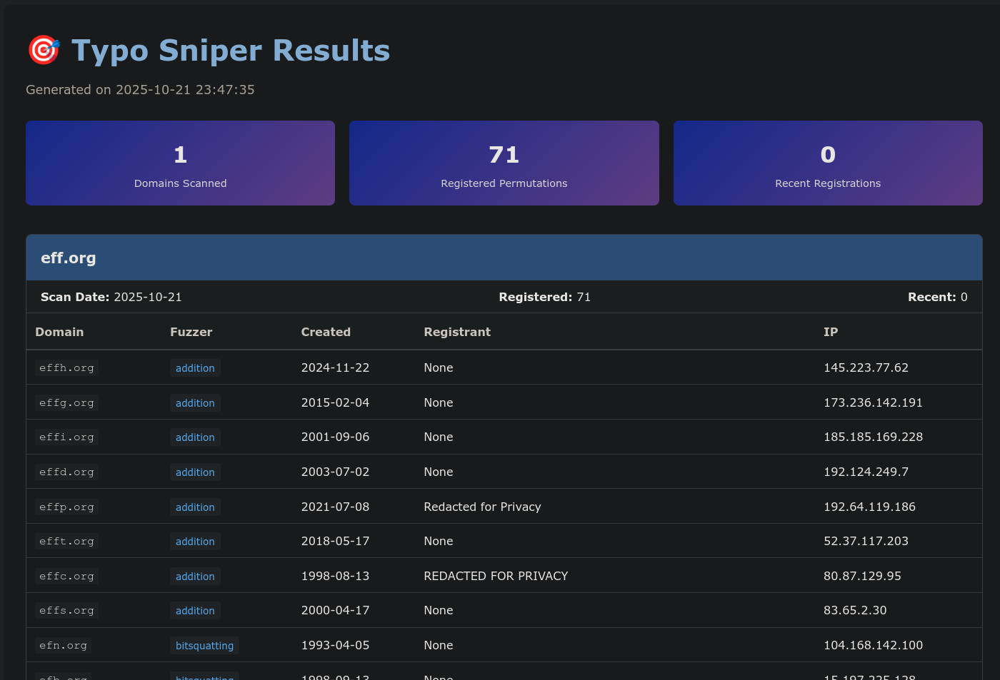

# Typo Sniper

<div align="center">



**Advanced Domain Typosquatting Detection Tool**

[](https://www.python.org/downloads/)
[](https://opensource.org/licenses/MPL-2.0)
[](https://github.com/chiefgyk3d/typo-sniper)

Detect and monitor typosquatting domains targeting your brand with powerful automation, threat intelligence, and beautiful reporting.

<br/>

---

> ⚠️ **Work in Progress:** Typo Sniper is under active development! Features, output, and documentation may change. Please [report any issues](https://github.com/chiefgyk3d/typo-sniper/issues) you find, and contributions are always welcome—see the [Contributing](#-contributing) section below!

</div>

---

## 📋 Table of Contents

**Quick Navigation:**
- [Documentation Guide](#-documentation-guide)
- [Quick Start](#-quick-start) ⚡ **Start here!**
- [Installation](#-installation)
- [Usage & Examples](#-usage)
- [Configuration](#-configuration)
- [Features](#-features)
- [Output Formats](#-output-formats) 📊 **Includes sample files!**
- [Architecture](#-architecture)
- [Advanced Usage](#-advanced-usage)
- [Troubleshooting](#-troubleshooting)
- [Contributing](#-contributing)
- [Secrets Management](#-secrets-management) 🔐
- [Testing & Verification](#-testing-and-verification)

---

## 📚 Documentation Guide


**New to Typo Sniper?** Start here:

| Document | Description | When to Use |
|:---|:---|:---|
| **[Quick Start Guide](docs/guides/QUICKSTART.md)** | 🚀 **Start here!** 10-minute guide to get running | First time setup, testing features |
| **[README.md](README.md)** | 📖 **You are here.** Complete overview and reference | Understanding features, basic usage |
| **[Enhancements](docs/guides/ENHANCEMENTS.md)** | 🔬 Deep dive into enhanced detection & threat intel | Understanding detection algorithms |
| **[ML Features](docs/ML_FEATURES.md)** | 🤖 **NEW!** Machine learning enhancement guide | ML-powered detection, active learning |
| **[Testing Guide](TESTING.md)** | 🧪 Comprehensive testing guide with API setup | Setting up APIs, troubleshooting |
| **[Debug Mode Guide](docs/guides/DEBUG_MODE.md)** | 🐛 Debug mode and troubleshooting guide | Troubleshooting, understanding what's running |
| **[Secrets Management](docs/guides/SECRETS_MANAGEMENT.md)** | 🔐 Complete secrets management guide | Choosing secrets solution, security |
| **[Docker Guide](docker/DOCKER.md)** | 🐳 Docker deployment guide | Container deployment |
| **[Project Structure](PROJECT_STRUCTURE.md)** | 📁 Project organization details | Contributing, understanding codebase |


> **Note:** Some topics (like secrets management) are now consolidated into this README for easier navigation. Use the table above to jump to the right section or external document.

**Secrets Management Options:**
- **Environment Variables** (easiest for testing)
- **[Doppler](https://doppler.com)** (⭐ recommended for production)
- **[AWS Secrets Manager](https://aws.amazon.com/secrets-manager/)** (AWS environments)
- **Config files** (development only - never commit!)

See **[Secrets Management](#-secrets-management)** for detailed comparisons and setup guides.

---

## ⚡ Quick Start

### 1️⃣ Install

```bash
# Clone repository
git clone https://github.com/chiefgyk3d/typo-sniper.git
cd typo-sniper

# Install dependencies
pip install -r requirements.txt
```

### 2️⃣ Create Domain List

```bash
echo "example.com" > test_domains.txt
```

### 3️⃣ Run Basic Scan

```bash
python src/typo_sniper.py -i test_domains.txt --format excel
```

### 4️⃣ View Results

```bash
# Results are in results/ directory
ls -lh results/
xdg-open results/typo_sniper_results_*.xlsx
```

> 💡 **Sample Output:** The `results/` directory includes sample output files (`sample.json`, `sample.csv`, `sample.html`, `sample.xlsx`) generated from scanning `eff.org`. These demonstrate what a real scan produces across all output formats.

**Want threat intelligence?** See [TESTING.md](TESTING.md) for API setup.

**[⬆ Back to Top](#-table-of-contents)**

---

## 📁 Project Structure

## Quick Comparison

| Method | Best For | Security | Setup Time | Cost |
|--------|----------|----------|------------|------|
| **Environment Variables** | Local testing, simple deployments | ⭐⭐ | 1 min | Free |
| **Config Files** | Development only | ⭐ | 2 min | Free |
| **Doppler** | Production, multi-environment | ⭐⭐⭐⭐⭐ | 10 min | Free tier available |
| **AWS Secrets Manager** | AWS-hosted applications | ⭐⭐⭐⭐ | 15 min | ~$0.50/month |

**[⬆ Back to Top](#-table-of-contents)**

---

## 🚀 Installation

### 1. Environment Variables

**Pros:**
- ✅ Simplest setup
- ✅ Works everywhere
- ✅ No additional dependencies
- ✅ No cost

**Cons:**
- ❌ Visible in process lists
- ❌ No audit trail
- ❌ Manual management
- ❌ No rotation support
- ❌ Risk of accidental exposure

**Best For:**
- Local development
- Quick testing
- CI/CD pipelines (with caution)
- Docker containers

**Setup:**
```bash
export TYPO_SNIPER_URLSCAN_API_KEY="your_key"
```

**Security Rating:** ⭐⭐ (2/5)

---

### 2. Config Files

**Pros:**
- ✅ Easy to manage
- ✅ Human-readable
- ✅ Version control friendly (with encryption)

**Cons:**
- ❌ Keys stored in plaintext
- ❌ Risk of accidental commit
- ❌ No centralized management
- ❌ No rotation support
- ❌ Must be secured separately

**Best For:**
- Development only
- Quick prototypes
- Single-machine deployments

**Setup:**
```yaml
# config.yaml
urlscan_api_key: "your_key_here"
```

**Security Rating:** ⭐ (1/5)

**⚠️ WARNING:** Never commit config files with API keys to version control!

---

### 3. Doppler (Recommended for Production)

**Pros:**
- ✅ Excellent security
- ✅ Automatic secrets injection
- ✅ Multi-environment support (dev, staging, prod)
- ✅ Audit logging
- ✅ Team access control
- ✅ Automatic rotation
- ✅ CLI and API access
- ✅ Integrations with many platforms
- ✅ Free tier available

**Cons:**
- ❌ Requires account setup
- ❌ Additional dependency (Doppler CLI)
- ❌ Learning curve

**Best For:**
- Production environments
- Team collaborations
- Multi-environment setups
- Security-conscious organizations
- Any deployment requiring audit trails

**Setup:**
```bash
# Install CLI
curl -Ls https://cli.doppler.com/install.sh | sudo sh

# Login and setup
doppler login
doppler setup

# Add secrets
doppler secrets set URLSCAN_API_KEY="your_key"

# Run application
doppler run -- python src/typo_sniper.py -i domains.txt
```

**Pricing:**
- Free tier: Unlimited secrets, 5 users
- Starter: $12/month, 10 users
- Professional: $24/month, 25 users
- Enterprise: Custom pricing

**Security Rating:** ⭐⭐⭐⭐⭐ (5/5)

**Features:**
- 🔐 AES-256 encryption at rest
- 🔄 Automatic secret rotation
- 📝 Complete audit logs
- 👥 Role-based access control
- 🔔 Webhook notifications
- 📊 Usage analytics
- 🌍 Multi-region support

**Learn More:** https://doppler.com

---

### 4. AWS Secrets Manager

**Pros:**
- ✅ Native AWS integration
- ✅ IAM-based access control
- ✅ Automatic rotation support
- ✅ Encryption with AWS KMS
- ✅ CloudTrail audit logging
- ✅ VPC endpoint support
- ✅ Works with IAM roles (no keys needed)

**Cons:**
- ❌ AWS-specific
- ❌ Additional cost
- ❌ Requires AWS knowledge
- ❌ More complex setup

**Best For:**
- AWS-hosted applications
- EC2 instances
- ECS/EKS containers
- Lambda functions
- Organizations already using AWS

**Setup:**
```bash
# Configure AWS CLI
aws configure

# Create secret
aws secretsmanager create-secret \
  --name typo-sniper/prod \
  --secret-string '{
    "urlscan_api_key": "your_key"
  }'

# Use in application
export AWS_SECRET_NAME="typo-sniper/prod"
python src/typo_sniper.py -i domains.txt
```

**Pricing:**
- $0.40 per secret per month
- $0.05 per 10,000 API calls
- Typical cost: ~$0.50/month per secret

**Security Rating:** ⭐⭐⭐⭐ (4/5)

**Features:**
- 🔐 KMS encryption
- 🔄 Automatic rotation (with Lambda)
- 📝 CloudTrail logging
- 🔑 IAM-based access
- 🌐 VPC endpoints
- 🏷️ Resource tagging

**Learn More:** https://aws.amazon.com/secrets-manager/

---

## Recommendations by Use Case

### Development / Testing
**Recommended:** Environment Variables or Config Files
```bash
export TYPO_SNIPER_URLSCAN_API_KEY="test_key"
python src/typo_sniper.py -i test.txt
```

### Production (General)
**Recommended:** Doppler
```bash
doppler run -- python src/typo_sniper.py -i domains.txt
```

### Production (AWS)
**Recommended:** AWS Secrets Manager
```bash
export AWS_SECRET_NAME="typo-sniper/prod"
python src/typo_sniper.py -i domains.txt
```

### CI/CD Pipelines
**Recommended:** Platform-native secrets (GitHub Secrets, GitLab CI/CD Variables, etc.) or Doppler

### Docker Deployments
**Recommended:** Environment variables (injected) or Doppler
```bash
docker run -e TYPO_SNIPER_URLSCAN_API_KEY="key" ...
# OR
docker run -e DOPPLER_TOKEN="token" ...
```

### Kubernetes
**Recommended:** Kubernetes Secrets + External Secrets Operator
```yaml
apiVersion: external-secrets.io/v1beta1
kind: ExternalSecret
metadata:
  name: typo-sniper-secrets
spec:
  secretStoreRef:
    name: doppler-secret-store  # or aws-secret-store
    kind: SecretStore
```

---

## 🔔 Maintainer Note

> **Note:** AWS Secrets Manager support is included because it is a common enterprise request, but it has **not been tested** by the maintainer (I do not use AWS in my home lab). If you encounter any issues with AWS integration, please open an issue or PR!
>
> For home labs and personal projects, I personally use and recommend **Doppler** for secrets management—it's easy, secure, and works great for local development and small teams.

---

## Security Best Practices

### General
1. ✅ Never commit secrets to version control
2. ✅ Rotate secrets regularly
3. ✅ Use principle of least privilege
4. ✅ Enable audit logging
5. ✅ Monitor secret access
6. ✅ Use different secrets per environment

### .gitignore Requirements
```gitignore
# Never commit these files
config.yaml
*_config.yaml
.env
.env.*
*.key
*.pem
tests/test_data/*.txt
tests/test_data/test_config.yaml

# Except examples
!config.yaml.example
!.env.example
```

### Environment Variables
```bash
# ✅ DO: Use prefixed variables
export TYPO_SNIPER_URLSCAN_API_KEY="key"

# ❌ DON'T: Echo secrets
echo $TYPO_SNIPER_URLSCAN_API_KEY

# ✅ DO: Unset when done
unset TYPO_SNIPER_URLSCAN_API_KEY
```

### Config Files
```bash
# ✅ DO: Restrict permissions
chmod 600 config.yaml

# ✅ DO: Store outside repo
mkdir ~/.typo_sniper
mv config.yaml ~/.typo_sniper/

# ✅ DO: Encrypt sensitive configs
# Use tools like git-crypt, SOPS, or age
```

---

## Migration Guide

### From Config Files to Environment Variables
```bash
# Extract from config
URLSCAN_KEY=$(grep urlscan_api_key config.yaml | cut -d'"' -f2)

# Set as env vars
export TYPO_SNIPER_URLSCAN_API_KEY="$URLSCAN_KEY"

# Remove from config
sed -i '/api_key/d' config.yaml
```

### From Environment Variables to Doppler
```bash
# Get current values
echo $TYPO_SNIPER_URLSCAN_API_KEY

# Setup Doppler
doppler login
doppler setup

# Import to Doppler
doppler secrets set URLSCAN_API_KEY="$TYPO_SNIPER_URLSCAN_API_KEY"

# Unset env vars
unset TYPO_SNIPER_URLSCAN_API_KEY

# Run with Doppler
doppler run -- python src/typo_sniper.py -i domains.txt
```

### From Doppler to AWS Secrets Manager
```bash
# Export from Doppler
doppler secrets download --format json > secrets.json

# Import to AWS
aws secretsmanager create-secret \
  --name typo-sniper/prod \
  --secret-string file://secrets.json

# Clean up local file
shred -u secrets.json

# Update config
export AWS_SECRET_NAME="typo-sniper/prod"
```

---

## Troubleshooting

### Secret Not Found
```bash
# Check all possible sources
env | grep -i "URLSCAN\|DOPPLER\|AWS"

# Verify Doppler
doppler secrets

# Verify AWS
aws secretsmanager get-secret-value --secret-id typo-sniper/prod

# Run with verbose logging
python src/typo_sniper.py -i domains.txt -v 2>&1 | grep -i secret
```

### Permission Denied (AWS)
```bash
# Check IAM permissions
aws sts get-caller-identity
aws iam get-user

# Test secret access
aws secretsmanager get-secret-value --secret-id typo-sniper/prod

# If using IAM role, verify it's attached
```

### Doppler Token Invalid
```bash
# Check token
echo $DOPPLER_TOKEN

# Re-login
doppler login
doppler setup

# Create new service token
doppler configs tokens create prod-token --plain
```

---

## Additional Resources

- **Doppler Documentation:** https://docs.doppler.com/
- **AWS Secrets Manager Guide:** https://docs.aws.amazon.com/secretsmanager/
- **Environment Variables Best Practices:** https://12factor.net/config
- **Typo Sniper Testing Guide:** [TESTING.md](TESTING.md)
- **Typo Sniper Quick Start:** [QUICKSTART.md](QUICKSTART.md)

---

## Summary

| Use Case | Recommendation | Setup Command |
|----------|----------------|---------------|
| Quick test | Environment Variables | `export TYPO_SNIPER_URLSCAN_API_KEY="key"` |
| Development | Config File + gitignore | `chmod 600 config.yaml` |
| Production | Doppler | `doppler run -- python src/typo_sniper.py` |
| AWS Production | AWS Secrets Manager | `export AWS_SECRET_NAME="typo-sniper/prod"` |
| Team Collaboration | Doppler | Setup team access in Doppler dashboard |
| CI/CD | Platform secrets + Doppler | Configure in CI/CD settings |

**Remember:** Never commit secrets to version control, always use the most secure option available for your environment, and rotate secrets regularly!

---

## Quick Start

### 1️⃣ Install

```bash
# Clone repository
git clone https://github.com/chiefgyk3d/typo-sniper.git
cd typo-sniper

# Install dependencies
pip install -r requirements.txt
```

### 2️⃣ Create Domain List

```bash
echo "example.com" > test_domains.txt
```

### 3️⃣ Run Basic Scan

```bash
python src/typo_sniper.py -i test_domains.txt --format excel
```

### 4️⃣ View Results

```bash
# Results are in results/ directory
ls -lh results/
xdg-open results/typo_sniper_results_*.xlsx
```

**Want threat intelligence?** See [QUICKSTART.md](QUICKSTART.md) for API setup.

---

## Project Structure

```
typo-sniper/
├── src/                           # Core Python source code
│   ├── __init__.py                # Package initialization
│   ├── cache.py                   # Caching system
│   ├── config.py                  # Configuration management
│   ├── exporters.py               # Output format exporters (Excel, JSON, CSV, HTML)
│   ├── scanner.py                 # Domain scanning & WHOIS enrichment
│   ├── enhanced_detection.py      # 🆕 Advanced detection algorithms
│   ├── threat_intelligence.py     # 🆕 Threat intel integrations
│   ├── secrets_manager.py         # 🆕 Secrets management
│   ├── typo_sniper.py             # Main application & CLI
│   ├── utils.py                   # Utility functions
│   └── monitored_domains.txt      # Example domain list
├── docker/                        # Docker-related files
│   ├── Dockerfile                 # Standard Docker image
│   ├── Dockerfile.doppler         # 🆕 Docker with Doppler support
│   ├── docker-compose.yml         # Docker Compose configuration
│   ├── docker-compose.threat-intel.yml  # 🆕 Compose with threat intel
│   ├── .dockerignore              # Docker build exclusions
│   ├── .env.example               # 🆕 Environment variables template
│   └── DOCKER.md                  # Docker usage guide
├── tests/                         # Unit tests
│   └── __init__.py                # Test package initialization
├── docs/                          # Documentation & configs
│   ├── LICENSE                    # MPL 2.0 License
│   └── config.yaml.example        # Example configuration
├── QUICKSTART.md                  # 🆕 Quick start guide (start here!)
├── TESTING.md                     # 🆕 Testing & API setup guide
<!-- SECRETS_MANAGEMENT.md has been removed from the project structure -->
├── ENHANCEMENTS.md                # 🆕 Feature documentation
├── PROJECT_STRUCTURE.md           # Project organization
├── requirements.txt               # Python dependencies
├── .gitignore                     # Git ignore rules
└── README.md                      # This file
```

**[⬆ Back to Top](#-table-of-contents)**

---

## 🎯 Features

### Core Capabilities
- **Comprehensive Detection** - Uses [dnstwist](https://github.com/elceef/dnstwist) for industry-leading typosquatting detection
- **Rich WHOIS Data** - Automatically enriches results with detailed WHOIS information
- **Async & Parallel** - Fast concurrent scanning with configurable worker pools
- **Smart Caching** - Avoid redundant WHOIS lookups with built-in caching
- **Date Filtering** - Focus on recently registered domains
- **Multiple Formats** - Export to Excel, JSON, CSV, and HTML

### Enhanced Detection Methods (Optional)
> 
>
> *"ENHANCE!" — Just like in the movies, but with more DNS lookups. Use enhanced detection with caution!*
- **Combo-Squatting** - Detects domains combining your brand with popular keywords (e.g., `example-shop.com`, `secure-example.com`)
  - 50+ keywords: login, secure, account, shop, store, support, admin, payment, verify, etc.
  - Multiple separators: hyphens, underscores, numbers
  - Configurable via `enable_combosquatting` setting

- **Sound-Alike Detection** - Finds domains that sound phonetically similar using Soundex and Metaphone algorithms
  - Example: `example.com` → `exampul.com`, `egzample.com`
  - Configurable via `enable_soundalike` setting

- **IDN Homograph Detection** - Identifies internationalized domain names using confusable Unicode characters
  - Example: `example.com` → `еxample.com` (Cyrillic 'е'), `exаmple.com` (Cyrillic 'а')
  - Detects mixed-script attacks using lookalike characters
  - Configurable via `enable_idn_homograph` setting

### Threat Intelligence Integration (Optional)
- **URLScan.io** - Analyze live website behavior and security posture
  - **Auto-enables when API key is configured** (no additional flags needed!)
  - Requires API key (free tier available at [urlscan.io](https://urlscan.io))
  - Smart scanning: checks for existing scans first, only submits new scan if older than `urlscan_max_age_days` (default: 7 days)
  - Waits up to `urlscan_wait_timeout` seconds (default: 90s) for scan results
  - Provides verdict: malicious, suspicious, clean with threat scores and categories
  - Returns screenshot URL and report URL for further investigation
  - Can be explicitly disabled with `ENABLE_URLSCAN=false` environment variable if needed
  - Configurable via `urlscan_api_key`, `urlscan_max_age_days`, `urlscan_wait_timeout`, and `urlscan_visibility`

- **Certificate Transparency Logs** - Monitor SSL/TLS certificate issuance
  - Tracks certificate history for domains
  - No API key required
  - Configurable via `enable_certificate_transparency`

- **HTTP Probing** - Test if domains are actively hosting content
  - Checks HTTP/HTTPS status codes
  - Configurable timeout (default: 10s)
  - Configurable via `enable_http_probe` and `http_timeout`

- **Risk Scoring** - Automated threat assessment (0-100 scale)
  - Combines threat intelligence signals
  - Color-coded in Excel reports (Red: 70+, Orange: 50-69, Yellow: 30-49)
  - Configurable via `enable_risk_scoring`

### Machine Learning Enhancement (Optional)
> **NEW!** ML-powered typosquatting detection with active learning
- **Intelligent Risk Scoring** - Gradient-boosted ML classifier (LightGBM) with 50+ engineered features
  - Lexical features: Edit distances, n-gram similarity, entropy, pronounceability
  - WHOIS features: Domain age, registrar reputation, privacy flags
  - DNS features: Record types, MX presence, nameserver patterns
  - Behavioral features: URLScan scores, certificate transparency, HTTP probes
  - Visual features: Homoglyph detection, confusable character analysis
  
- **Active Learning** - Continuously improve detection with minimal human effort
  - Uncertainty sampling: Automatically identifies domains needing review (40-60% confidence)
  - Model disagreement tracking across versions
  - Label collection and retraining workflow
  - Batch review export/import for security analysts
  
- **Explainable AI** - Understand why domains are flagged
  - SHAP values show which features contributed to each prediction
  - Feature importance ranking
  - Human-readable explanations: "Levenshtein Distance increases suspicion"
  
- **Synthetic Data Generation** - Augment training data with realistic typosquats
  - Character insertion/deletion/substitution
  - Homoglyph substitution (Unicode confusables)
  - Keyboard proximity errors (QWERTY layout)
  - TLD swaps and variations
  
- **See [docs/ML_FEATURES.md](docs/ML_FEATURES.md) for complete ML documentation**

### Key Features
- Complete with modern Python async/await
- Modular, object-oriented architecture
- Beautiful CLI with progress bars and colored output
- Enhanced Excel reports with multiple sheets and rich formatting
- Stunning HTML reports with responsive design
- YAML-based configuration system
- Intelligent retry logic and error handling
- Comprehensive logging with Rich integration
- Significant performance improvements

**[⬆ Back to Top](#-table-of-contents)**

---

## 🚀 Installation

### Docker (Recommended)

The easiest way to run Typo Sniper is using Docker:

```bash
# Clone the repository
git clone https://github.com/chiefgyk3d/typo-sniper.git
cd typo-sniper


# Build the Docker image
docker build -f docker/Dockerfile -t typo-sniper:1.1 .

# Run a scan
docker run --rm \
  -v "$(pwd)/src/monitored_domains.txt:/app/data/domains.txt:ro" \
  -v "$(pwd)/results:/app/results" \
  typo-sniper:1.1 \
  -i /app/data/domains.txt \
  --format excel json
```

See [docker/DOCKER.md](docker/DOCKER.md) for comprehensive Docker usage guide.

### Standard Installation

### Prerequisites
- Python 3.8 or higher
- pip package manager

### Quick Install

```bash
# Clone the repository
git clone https://github.com/chiefgyk3d/typo-sniper.git
cd typo-sniper

# Install dependencies
pip install -r requirements.txt
```

### Security Note: Pinned Dependencies

All dependencies are **pinned to specific versions** in `requirements.txt` to protect against supply chain attacks like [Shai-Hulud](https://www.crowdstrike.com/blog/shai-hulud-suspicious-pypi-packages/) and other compromised library incidents. These versions have been verified as secure at the time of release.

**Why we pin versions:**
- Prevents automatic installation of potentially compromised newer versions
- Ensures reproducible builds and consistent behavior
- Versions are tested and verified to work together
- Makes security audits easier and more reliable

**If you want to experiment with newer versions:**
```bash
# Create a test environment
python3 -m venv test-env
source test-env/bin/activate

# Install with newer versions (at your own risk)
pip install --upgrade dnstwist python-whois PyYAML openpyxl rich aiofiles

# Test thoroughly before using in production
python typo_sniper.py --help
```

**Recommended practice:** Review the changelog and security advisories before upgrading any dependency.

### Using Virtual Environment (Recommended)

```bash
# Create virtual environment
python3 -m venv venv

# Activate virtual environment
# On Linux/Mac:
source venv/bin/activate
# On Windows:
# venv\Scripts\activate

# Install dependencies
pip install -r requirements.txt
```

**[⬆ Back to Top](#-table-of-contents)**

---

## 📖 Usage

### Command-Line Interface

```bash
python src/typo_sniper.py [OPTIONS]
```

### Options

| Option | Description | Default |
|--------|-------------|---------|
| `-i, --input FILE` | Input file with domains to monitor | `monitored_domains.txt` |
| `-o, --output DIR` | Output directory for results | `results/` |
| `--format FORMAT [FORMAT ...]` | Output formats (excel, json, csv, html) | `excel` |
| `--months N` | Filter domains registered in last N months (0 = no filter) | `0` |
| `--config FILE` | Path to YAML configuration file | None |
| `--max-workers N` | Maximum concurrent workers | `10` |
| `--cache-ttl SECONDS` | Cache TTL in seconds | `86400` (24h) |
| `--no-cache` | Disable caching | False |
| `--ml` | Enable machine learning predictions | False |
| `--ml-model PATH` | Path to custom ML model file | None |
| `--ml-review N` | Export N domains for manual review (active learning) | `0` |
| `-v, --verbose` | Enable verbose output (INFO level) | False |
| `--debug` | Enable debug output (DEBUG level with tracing) | False |
| `--version` | Show version and exit | - |

### Examples

#### Basic Scan
```bash
# Scan domains from default file
python src/typo_sniper.py

# Scan with custom input file
python src/typo_sniper.py -i src/my_domains.txt
```

#### Filter by Registration Date
```bash
# Domains registered in last 1 month
python src/typo_sniper.py --months 1

# Domains registered in last 6 months
python src/typo_sniper.py --months 6
```

#### Multiple Export Formats
```bash
# Export to Excel and JSON
python src/typo_sniper.py --format excel json

# Export to all formats
python src/typo_sniper.py --format excel json csv html
```

#### Performance Tuning
```bash
# Increase concurrent workers for faster scanning
python src/typo_sniper.py --max-workers 20

# Disable cache for fresh data
python src/typo_sniper.py --no-cache

# Longer cache TTL (1 week)
python src/typo_sniper.py --cache-ttl 604800
```

#### Custom Configuration
```bash
# Use custom config file
python src/typo_sniper.py --config docs/my_config.yaml
```

#### Verbose Mode
```bash
# Enable verbose logging (INFO level)
python src/typo_sniper.py -v

# Enable debug logging (DEBUG level with detailed tracing)
python src/typo_sniper.py --debug
```

> 💡 **Tip:** Use `--debug` to troubleshoot issues like "why am I getting 0 enhanced detections?" It will show you which features are enabled/disabled. See [DEBUG_MODE.md](DEBUG_MODE.md) for details.

#### Machine Learning Enhancement (Optional)
```bash
# Enable ML predictions with default model
python src/typo_sniper.py --ml

# Use custom trained model
python src/typo_sniper.py --ml --ml-model models/my_model.pkl

# Enable ML with active learning (export 20 uncertain domains for review)
python src/typo_sniper.py --ml --ml-review 20

# Combine with other features
python src/typo_sniper.py --ml --months 1 --format excel json
```

> 🤖 **Note:** ML features require additional dependencies. See [docs/ML_QUICKSTART.md](docs/ML_QUICKSTART.md) for setup instructions.

**[⬆ Back to Top](#-table-of-contents)**

---

## ⚙️ Configuration

Typo Sniper can be configured using a YAML file. Copy the example configuration:

```bash
cp config.yaml.example config.yaml
```

### Configuration Options

```yaml
# Performance settings
max_workers: 10                    # Concurrent workers
rate_limit_delay: 1.0              # Delay between batches (seconds)

# Cache settings
use_cache: true                    # Enable caching
cache_dir: ~/.typo_sniper/cache    # Cache location
cache_ttl: 86400                   # Cache TTL (24 hours)

# Filter settings
months_filter: 0                   # Registration date filter (0 = disabled)

# dnstwist settings
dnstwist_threads: 20               # dnstwist thread count
dnstwist_mxcheck: true             # Check MX records
dnstwist_phash: false              # Perceptual hashing (requires ssdeep)

# Output settings
output_dir: results                # Output directory

# WHOIS settings
whois_timeout: 30                  # Query timeout
whois_retry_count: 3               # Retry attempts
whois_retry_delay: 5               # Retry delay

# Enhanced Detection (Optional - WARNING: Can significantly slow scans!)
enable_combosquatting: false       # Detect brand+keyword combinations (~360+ variations/domain)
enable_soundalike: false           # Detect phonetically similar domains
enable_idn_homograph: false        # Detect IDN homograph attacks (up to 50 variations/domain)

# Threat Intelligence (Optional)
enable_urlscan: false              # Check URLScan.io analysis
urlscan_api_key: ""                # URLScan.io API key (required if enabled)

enable_certificate_transparency: false  # Check CT logs
enable_http_probe: false           # Probe HTTP/HTTPS endpoints
http_timeout: 10                   # HTTP probe timeout (seconds)

enable_risk_scoring: false         # Calculate risk scores (0-100)

# Machine Learning (Optional - Requires additional dependencies)
enable_ml: false                   # Enable ML predictions
ml_model_path: models/model.pkl    # Path to trained model
ml_confidence_threshold: 0.7       # Minimum confidence for predictions
ml_enable_active_learning: false   # Enable active learning
ml_uncertainty_threshold: 0.3      # Uncertainty threshold for review
ml_review_budget: 20               # Max domains to flag for review
```

### Enhanced Detection Examples

#### Combo-Squatting Detection
Finds domains combining your brand with popular keywords:
```bash
# Enable combo-squatting in config.yaml
enable_combosquatting: true

# Results might include:
example-login.com
secure-example.com
example-shop.net
myexample-support.com
```

#### Sound-Alike Detection
Finds phonetically similar domains:
```bash
# Enable sound-alike in config.yaml
enable_soundalike: true

# Results might include:
exampul.com      # Soundex match
egzample.com     # Metaphone match
exampel.com      # Phonetic variation
```

#### IDN Homograph Detection
Finds Unicode lookalike domains:
```bash
# Enable IDN homograph in config.yaml
enable_idn_homograph: true

# Results might include:
еxample.com      # Cyrillic 'е' instead of 'e'
exаmple.com      # Cyrillic 'а' instead of 'a'
ехаmple.com      # Multiple Cyrillic characters
```

### Threat Intelligence Examples

#### URLScan.io Integration
```yaml
# Enable URLScan in config.yaml
enable_urlscan: true
urlscan_api_key: "your_api_key_here"
urlscan_max_age_days: 7  # Submit new scan if existing scan is older than 7 days
urlscan_wait_timeout: 90  # Wait up to 90 seconds for new scan results

# Get free API key at: https://urlscan.io/user/signup
# Free tier: 5,000 scans/month
```

**Smart Scanning Behavior:**
- Checks for existing scans first
- Only submits new scan if no recent scan exists (older than `urlscan_max_age_days`)
- Waits for and retrieves results from new scans
- Uses cached results when available to save API quota

Results include:
- Verdict: malicious, suspicious, or clean
- Screenshot availability
- Technology stack detected
- Scan age (to see how fresh the data is)

#### Certificate Transparency Monitoring
```yaml
# Enable CT logs (no API key required)
enable_certificate_transparency: true
```

Results include:
- Number of certificates issued
- Certificate authorities used
- Issuance timeline

#### HTTP Probing
```yaml
# Enable HTTP probing
enable_http_probe: true
http_timeout: 10  # seconds
```

Results include:
- HTTP/HTTPS status codes
- Redirect chains
- Active/inactive status

#### Risk Scoring
```yaml
# Enable automated risk scoring
enable_risk_scoring: true
```

Risk scores (0-100) are calculated based on:
- URLScan malicious verdict (+25 points)
- Recent registration (+15 points)
- Active HTTP endpoint (+10 points)
- Certificate transparency presence (+5 points)

**Excel Color Coding:**
- 🔴 Red (70-100): High risk - immediate investigation
- 🟠 Orange (50-69): Medium risk - monitor closely
- 🟡 Yellow (30-49): Low-medium risk - routine review
- ⚪ White (0-29): Low risk

#### Machine Learning Enhancement
```yaml
# Enable ML predictions (requires additional dependencies)
enable_ml: true
ml_model_path: models/trained_model.pkl
ml_confidence_threshold: 0.7  # Only show predictions with 70%+ confidence

# Optional: Enable active learning
ml_enable_active_learning: true
ml_uncertainty_threshold: 0.3  # Flag domains where model is uncertain
ml_review_budget: 20  # Export top 20 uncertain domains for manual review
```

**ML Features:**
- Intelligent risk scoring using gradient boosting (LightGBM/CatBoost)
- Active learning to improve model with manual feedback
- Explainable AI with SHAP values
- Outputs include: ML Risk Score, Confidence, Verdict, Review Flag

**Setup:**
```bash
# Install ML dependencies
pip install lightgbm catboost scikit-learn shap numpy pandas

# Train initial model or use pre-trained
# See docs/ML_QUICKSTART.md for complete guide
```

**Export Formats:**
- Excel: Adds ML columns (Risk Score, Confidence, Verdict, Needs Review)
- CSV: Includes all ML predictions
- JSON: Full ML metadata
- Review Batch: Separate CSV with uncertain domains for labeling

> 🤖 **Quick Start:** See [docs/ML_QUICKSTART.md](docs/ML_QUICKSTART.md) for a 5-minute setup guide.

**[⬆ Back to Top](#-table-of-contents)**

---

## 📊 Output Formats

### Excel (.xlsx)
- **Summary Sheet** - Overview of all scanned domains
- **Details Sheet** - Complete permutation data with WHOIS info
- **Statistics Sheet** - Scan statistics and fuzzer distribution
- Rich formatting with colors, fonts, and highlighting
- Auto-adjusted column widths
- Frozen header rows

### JSON (.json)
- Structured data format
- Easy to parse programmatically
- Includes metadata and timestamps
- Perfect for automation and APIs

### CSV (.csv)
- Simple comma-separated values
- Compatible with all spreadsheet tools
- One row per permutation
- All WHOIS and DNS data included

### HTML (.html)
- Beautiful, responsive design
- Interactive tables
- Summary statistics cards
- Recent registrations highlighted
- Print-friendly layout
- No external dependencies

### Sample Output Files

The repository includes sample output files in the `results/` directory:
- `sample.json` - JSON format example (121KB, 71 domain permutations)
- `sample.csv` - CSV format example (29KB)
- `sample.html` - HTML report example (28KB) - see screenshot below
- `sample.xlsx` - Excel workbook example (18KB)

These samples were generated from scanning `eff.org` and show what a typical scan produces.

**HTML Report Screenshot:**


*Interactive HTML report showing domain permutations, WHOIS data, and summary statistics*

**[⬆ Back to Top](#-table-of-contents)**

---

## 🏗️ Architecture

Typo Sniper follows a modular architecture:

```
typo-sniper/
├── src/                    # Core Python source code
│   ├── __init__.py         # Package initialization
│   ├── cache.py            # Caching system
│   ├── config.py           # Configuration management
│   ├── exporters.py        # Output format exporters
│   ├── scanner.py          # Domain scanning & WHOIS enrichment
│   ├── typo_sniper.py      # Main application & CLI
│   ├── utils.py            # Utility functions
│   └── monitored_domains.txt # Domain list
├── docker/                 # Docker-related files
│   ├── Dockerfile          # Docker image definition
│   ├── docker-compose.yml  # Docker Compose configuration
│   ├── .dockerignore       # Docker build exclusions
│   └── DOCKER.md           # Docker usage guide
├── tests/                  # Unit tests
│   └── __init__.py         # Test package initialization
├── docs/                   # Documentation
│   ├── LICENSE             # MPL 2.0 License
│   └── config.yaml.example # Example configuration
├── requirements.txt        # Python dependencies
├── .gitignore              # Git ignore rules
└── README.md               # Main project README
```

### Key Components

- **TypoSniper** - Main orchestrator class
- **DomainScanner** - Handles domain permutation and WHOIS lookups
- **Cache** - File-based caching system with TTL
- **Exporters** - Pluggable export system (Excel, JSON, CSV, HTML)
- **Config** - YAML-based configuration with dataclasses

---

## How It Works

1. **Load Domains** - Read domains from input file
2. **Generate Permutations** - Use dnstwist to create typosquatting variants
3. **Check Registration** - Identify registered domains via DNS
4. **Enrich with WHOIS** - Fetch detailed WHOIS data (with caching)
5. **Filter Results** - Apply date filters if configured
6. **Export Results** - Generate reports in requested formats

### Fuzzer Types

Typo Sniper uses multiple fuzzing techniques:
- Character addition/omission
- Character repetition/replacement
- Character transposition
- Homoglyph substitution
- Hyphenation variants
- Vowel swapping
- TLD variations
- Bitsquatting
- And more...

---

## Use Cases

### Brand Protection
Monitor for typosquatting domains that could:
- Phish your customers
- Damage your brand reputation
- Steal traffic
- Distribute malware

### Security Operations
- Identify newly registered lookalike domains
- Track suspicious domain patterns
- Generate IOCs for threat intelligence
- Automate domain monitoring workflows

### Research & Analysis
- Study typosquatting trends
- Analyze domain registration patterns
- Research homoglyph abuse
- Investigate cybersquatting

**[⬆ Back to Top](#-table-of-contents)**

---

## 🔧 Advanced Usage

### Automation with Cron

```bash
# Run daily at 2 AM
0 2 * * * cd /path/to/typo-sniper && python src/typo_sniper.py --months 1
```

### Integration with Other Tools

```python
# Use as a Python module
import sys
sys.path.append('/path/to/typo-sniper/src')

from typo_sniper import Config, DomainScanner, Cache
import asyncio

async def scan_domain(domain):
    config = Config()
    cache = Cache(config.cache_dir)
    scanner = DomainScanner(config, cache)
    
    result = await scanner.scan_domain(domain)
    return result

# Run scan
result = asyncio.run(scan_domain("example.com"))
print(f"Found {len(result['permutations'])} registered permutations")
```

### Cache Management

```python
from cache import Cache
from pathlib import Path

cache = Cache(Path.home() / '.typo_sniper' / 'cache')

# Get cache statistics
stats = cache.get_stats()
print(f"Cache entries: {stats['total_entries']}")
print(f"Cache size: {stats['total_size_mb']} MB")

# Clear expired entries
expired = cache.clear_expired()
print(f"Cleared {expired} expired entries")

# Clear all cache
cache.clear()
```

---

## Troubleshooting

### Common Issues

**Issue: "Module not found" errors**
```bash
# Solution: Ensure all dependencies are installed
pip install -r requirements.txt
```

**Issue: WHOIS lookups timing out**
```bash
# Solution: Increase timeout or reduce workers
python typo_sniper.py --whois-timeout 60 --max-workers 5
```

**Issue: Rate limiting errors**
```bash
# Solution: Reduce concurrent workers and enable delays
python typo_sniper.py --max-workers 5 --rate-limit-delay 2
```

**Issue: Cache directory permission errors**
```bash
# Solution: Change cache directory
python typo_sniper.py --config config.yaml
# Edit config.yaml and set cache_dir to writable location
```

**[⬆ Back to Top](#-table-of-contents)**

---

## 🚀 Future Enhancements

The following features are planned for future releases:

### Serverless Deployment
- **AWS Lambda Integration** - Deploy as serverless function with Terraform
- **Automated IOC Export** - Direct integration with threat intelligence platforms
- **Scheduled Scanning** - Automated periodic domain monitoring via cloud events

### Enterprise Integration
- **CrowdStrike Foundry Module** - Native integration when CrowdStrike is available
- **IOC Feed Generation** - Export results as structured IOCs for SIEM/EDR ingestion
- **API Endpoints** - RESTful API for programmatic access and automation

### Infrastructure as Code
- **Terraform Modules** - Complete AWS deployment automation
- **CloudWatch Integration** - Alerting and monitoring capabilities
- **S3 Result Storage** - Scalable cloud-based result archival

Contributions and feedback on these planned features are welcome!

**[⬆ Back to Top](#-table-of-contents)**

---

## 🤝 Contributing

Contributions are welcome! Please feel free to:
- Report bugs
- Suggest features
- Submit pull requests
- Improve documentation

This project is committed to remaining open source under the Mozilla Public License 2.0 to ensure the core code stays free while allowing flexible integration.

---

## License

This project is licensed under the Mozilla Public License 2.0 - see the LICENSE file for details.

**Why MPL 2.0?** This license offers the best of both worlds - it keeps modifications to the core files open source (weak copyleft at file level), while allowing integration with proprietary code. It includes patent protection and is ideal for security tools that may be integrated into larger systems or enterprise environments.

---

## Acknowledgments

- **[dnstwist](https://github.com/elceef/dnstwist)** - The excellent typosquatting detection engine
- **[python-whois](https://github.com/richardpenman/whois)** - WHOIS parsing library
- **[Rich](https://github.com/Textualize/rich)** - Beautiful terminal formatting
- **[OpenPyXL](https://openpyxl.readthedocs.io/)** - Excel file generation

---

## Contact

**Author:** chiefgyk3d

**Version:** 1.1

**Repository:** https://github.com/chiefgyk3d/typo-sniper

---

<div align="center">

Made for brand protection and security research

**[Back to Top](#typo-sniper)**

</div>

**[⬆ Back to Top](#-table-of-contents)**

---

## 🔐 Secrets Management

<details>
<summary><strong>Table of Contents</strong> (click to expand)</summary>

- [Quick Comparison](#quick-comparison-1)
- [Priority Order](#priority-order-1)
- [Detailed Comparison](#detailed-comparison-1)
  - [Environment Variables](#1-environment-variables-1)
  - [Config Files](#2-config-files-1)
  - [Doppler (Recommended for Production)](#3-doppler-recommended-for-production-1)
  - [AWS Secrets Manager](#4-aws-secrets-manager-1)
- [Recommendations by Use Case](#recommendations-by-use-case-1)
- [Security Best Practices](#security-best-practices-1)
- [.gitignore Requirements](#gitignore-requirements-1)
- [Migration Guide](#migration-guide-1)
- [Troubleshooting Secrets](#troubleshooting-secrets)
- [Additional Resources](#additional-resources-1)
- [Summary Table](#summary-table)

</details>

---

### Secrets Management Options for Typo Sniper

Typo Sniper supports multiple methods for managing API keys and secrets. Choose the option that best fits your environment and security requirements.

### Quick Comparison

| Method | Best For | Security | Setup Time | Cost |
|--------|----------|----------|------------|------|
| **Environment Variables** | Local testing, simple deployments | ⭐⭐ | 1 min | Free |
| **Config Files** | Development only | ⭐ | 2 min | Free |
| **Doppler** | Production, multi-environment | ⭐⭐⭐⭐⭐ | 10 min | Free tier available |
| **AWS Secrets Manager** | AWS-hosted applications | ⭐⭐⭐⭐ | 15 min | ~$0.50/month |

### Priority Order

When multiple secrets sources are configured, Typo Sniper checks them in this order:

1. **Environment Variables** (`TYPO_SNIPER_*` prefix)
2. **Doppler** (if `DOPPLER_TOKEN` set)
3. **AWS Secrets Manager** (if `AWS_SECRET_NAME` set)
4. **Alternate Environment Variables** (no prefix)
5. **Config File** (YAML)

### Detailed Comparison

#### 1. Environment Variables

**Pros:**
- ✅ Simplest setup
- ✅ Works everywhere
- ✅ No additional dependencies
- ✅ No cost

**Cons:**
- ❌ Visible in process lists
- ❌ No audit trail
- ❌ Manual management
- ❌ No rotation support
- ❌ Risk of accidental exposure

**Best For:**
- Local development
- Quick testing
- CI/CD pipelines (with caution)
- Docker containers

**Setup:**
```bash
export TYPO_SNIPER_URLSCAN_API_KEY="your_key"
```

**Security Rating:** ⭐⭐ (2/5)

---

#### 2. Config Files

**Pros:**
- ✅ Easy to manage
- ✅ Human-readable
- ✅ Version control friendly (with encryption)

**Cons:**
- ❌ Keys stored in plaintext
- ❌ Risk of accidental commit
- ❌ No centralized management
- ❌ No rotation support
- ❌ Must be secured separately

**Best For:**
- Development only
- Quick prototypes
- Single-machine deployments

**Setup:**
```yaml
# config.yaml
urlscan_api_key: "your_key_here"
```

**Security Rating:** ⭐ (1/5)

**⚠️ WARNING:** Never commit config files with API keys to version control!

---

#### 3. Doppler (Recommended for Production)

**Pros:**
- ✅ Excellent security
- ✅ Automatic secrets injection
- ✅ Multi-environment support (dev, staging, prod)
- ✅ Audit logging
- ✅ Team access control
- ✅ Automatic rotation
- ✅ CLI and API access
- ✅ Integrations with many platforms
- ✅ Free tier available

**Cons:**
- ❌ Requires account setup
- ❌ Additional dependency (Doppler CLI)
- ❌ Learning curve

**Best For:**
- Production environments
- Team collaborations
- Multi-environment setups
- Security-conscious organizations
- Any deployment requiring audit trails

**Setup:**
```bash
# Install CLI
curl -Ls https://cli.doppler.com/install.sh | sudo sh

# Login and setup
doppler login
doppler setup

# Add secrets
doppler secrets set URLSCAN_API_KEY="your_key"

# Run application
doppler run -- python src/typo_sniper.py -i domains.txt
```

**Pricing:**
- Free tier: Unlimited secrets, 5 users
- Starter: $12/month, 10 users
- Professional: $24/month, 25 users
- Enterprise: Custom pricing

**Security Rating:** ⭐⭐⭐⭐⭐ (5/5)

**Features:**
- 🔐 AES-256 encryption at rest
- 🔄 Automatic secret rotation
- 📝 Complete audit logs
- 👥 Role-based access control
- 🔔 Webhook notifications
- 📊 Usage analytics
- 🌍 Multi-region support

**Learn More:** https://doppler.com

---

#### 4. AWS Secrets Manager

**Pros:**
- ✅ Native AWS integration
- ✅ IAM-based access control
- ✅ Automatic rotation support
- ✅ Encryption with AWS KMS
- ✅ CloudTrail audit logging
- ✅ VPC endpoint support
- ✅ Works with IAM roles (no keys needed)

**Cons:**
- ❌ AWS-specific
- ❌ Additional cost
- ❌ Requires AWS knowledge
- ❌ More complex setup

**Best For:**
- AWS-hosted applications
- EC2 instances
- ECS/EKS containers
- Lambda functions
- Organizations already using AWS

**Setup:**
```bash
# Configure AWS CLI
aws configure

# Create secret
aws secretsmanager create-secret \
  --name typo-sniper/prod \
  --secret-string '{
    "urlscan_api_key": "your_key"
  }'

# Use in application
export AWS_SECRET_NAME="typo-sniper/prod"
python src/typo_sniper.py -i domains.txt
```

**Pricing:**
- $0.40 per secret per month
- $0.05 per 10,000 API calls
- Typical cost: ~$0.50/month per secret

**Security Rating:** ⭐⭐⭐⭐ (4/5)

**Features:**
- 🔐 KMS encryption
- 🔄 Automatic rotation (with Lambda)
- 📝 CloudTrail logging
- 🔑 IAM-based access
- 🌐 VPC endpoints
- 🏷️ Resource tagging

**Learn More:** https://aws.amazon.com/secrets-manager/

---

### Recommendations by Use Case

**Development / Testing:**
Environment Variables or Config Files
```bash
export TYPO_SNIPER_URLSCAN_API_KEY="test_key"
python src/typo_sniper.py -i test.txt
```

**Production (General):**
Doppler
```bash
doppler run -- python src/typo_sniper.py -i domains.txt
```

**Production (AWS):**
AWS Secrets Manager
```bash
export AWS_SECRET_NAME="typo-sniper/prod"
python src/typo_sniper.py -i domains.txt
```

**CI/CD Pipelines:**
Platform-native secrets (GitHub Secrets, GitLab CI/CD Variables, etc.) or Doppler

**Docker Deployments:**
Environment variables (injected) or Doppler
```bash
docker run -e TYPO_SNIPER_URLSCAN_API_KEY="key" ...
# OR
docker run -e DOPPLER_TOKEN="token" ...
```

**Kubernetes:**
Kubernetes Secrets + External Secrets Operator
```yaml
apiVersion: external-secrets.io/v1beta1
kind: ExternalSecret
metadata:
  name: typo-sniper-secrets
spec:
  secretStoreRef:
    name: doppler-secret-store  # or aws-secret-store
    kind: SecretStore
```

---

### 🔔 Maintainer Note

> **Note:** AWS Secrets Manager support is included because it is a common enterprise request, but it has **not been tested** by the maintainer (I do not use AWS in my home lab). If you encounter any issues with AWS integration, please open an issue or PR!
>
> For home labs and personal projects, I personally use and recommend **Doppler** for secrets management—it's easy, secure, and works great for local development and small teams.

---

### Security Best Practices

**General:**
1. ✅ Never commit secrets to version control
2. ✅ Rotate secrets regularly
3. ✅ Use principle of least privilege
4. ✅ Enable audit logging
5. ✅ Monitor secret access
6. ✅ Use different secrets per environment

**`.gitignore` Requirements:**
```gitignore
# Never commit these files
config.yaml
test_config.yaml
*_config.yaml
.env
.env.*
*.key
*.pem

# Except examples
!config.yaml.example
!.env.example
```

**Environment Variables:**
```bash
# ✅ DO: Use prefixed variables
export TYPO_SNIPER_URLSCAN_API_KEY="key"

# ❌ DON'T: Echo secrets
echo $TYPO_SNIPER_URLSCAN_API_KEY

# ✅ DO: Unset when done
unset TYPO_SNIPER_URLSCAN_API_KEY
```

**Config Files:**
```bash
# ✅ DO: Restrict permissions
chmod 600 config.yaml

# ✅ DO: Store outside repo
mkdir ~/.typo_sniper
mv config.yaml ~/.typo_sniper/

# ✅ DO: Encrypt sensitive configs
# Use tools like git-crypt, SOPS, or age
```

---

## Migration Guide

**From Config Files to Environment Variables:**
```bash
# Extract from config
URLSCAN_KEY=$(grep urlscan_api_key config.yaml | cut -d'"' -f2)

# Set as env vars
export TYPO_SNIPER_URLSCAN_API_KEY="$URLSCAN_KEY"

# Remove from config
sed -i '/api_key/d' config.yaml
```

**From Environment Variables to Doppler:**
```bash
# Get current values
echo $TYPO_SNIPER_URLSCAN_API_KEY

# Setup Doppler
doppler login
doppler setup

# Import to Doppler
doppler secrets set URLSCAN_API_KEY="$TYPO_SNIPER_URLSCAN_API_KEY"

# Unset env vars
unset TYPO_SNIPER_URLSCAN_API_KEY

# Run with Doppler
doppler run -- python src/typo_sniper.py -i domains.txt
```

**From Doppler to AWS Secrets Manager:**
```bash
# Export from Doppler
doppler secrets download --format json > secrets.json

# Import to AWS
aws secretsmanager create-secret \
  --name typo-sniper/prod \
  --secret-string file://secrets.json

# Clean up local file
shred -u secrets.json

# Update config
export AWS_SECRET_NAME="typo-sniper/prod"
```

---

## Troubleshooting Secrets

**Secret Not Found:**
```bash
# Check all possible sources
env | grep -i "URLSCAN\|DOPPLER\|AWS"

# Verify Doppler
doppler secrets

# Verify AWS
aws secretsmanager get-secret-value --secret-id typo-sniper/prod

# Run with verbose logging
python src/typo_sniper.py -i domains.txt -v 2>&1 | grep -i secret
```

**Permission Denied (AWS):**
```bash
# Check IAM permissions
aws sts get-caller-identity
aws iam get-user

# Test secret access
aws secretsmanager get-secret-value --secret-id typo-sniper/prod

# If using IAM role, verify it's attached
```

**Doppler Token Invalid:**
```bash
# Check token
echo $DOPPLER_TOKEN

# Re-login
doppler login
doppler setup

# Create new service token
doppler configs tokens create prod-token --plain
```

---

### Additional Resources

- **Doppler Documentation:** https://docs.doppler.com/
- **AWS Secrets Manager Guide:** https://docs.aws.amazon.com/secretsmanager/
- **Environment Variables Best Practices:** https://12factor.net/config
- **Typo Sniper Testing Guide:** [TESTING.md](TESTING.md)
- **Typo Sniper Quick Start:** [QUICKSTART.md](QUICKSTART.md)

---

### Summary Table

| Use Case | Recommendation | Setup Command |
|----------|----------------|---------------|
| Quick test | Environment Variables | `export TYPO_SNIPER_URLSCAN_API_KEY="key"` |
| Development | Config File + gitignore | `chmod 600 config.yaml` |
| Production | Doppler | `doppler run -- python src/typo_sniper.py` |
| AWS Production | AWS Secrets Manager | `export AWS_SECRET_NAME="typo-sniper/prod"` |
| Team Collaboration | Doppler | Setup team access in Doppler dashboard |
| CI/CD | Platform secrets + Doppler | Configure in CI/CD settings |

**Remember:** Never commit secrets to version control, always use the most secure option available for your environment, and rotate secrets regularly!

---

## 🧪 Testing and Verification

This section provides a comprehensive guide to testing Typo Sniper's functionality.

### Prerequisites

1. **Install dependencies** (if not already done):
```bash
pip install -r requirements.txt
```

2. **Install optional dependency** for better DNS features:
```bash
pip install dnspython
```

### Quick Tests

> 💡 **Quick Preview:** Before running your own scans, check out the sample output files in the `results/` directory (`sample.json`, `sample.csv`, `sample.html`, `sample.xlsx`). These were generated from scanning `eff.org` and show what real results look like!

#### 1. Check Version
```bash
python src/typo_sniper.py --version
```
Expected output: `Typo Sniper v1.0.0`

#### 2. View Help
```bash
python src/typo_sniper.py --help
```
Should display all available options and examples.

#### 3. Basic Scan (JSON output)
```bash
python src/typo_sniper.py -i src/monitored_domains.txt --format json
```
- Scans domains from `src/monitored_domains.txt`
- Generates JSON output in `results/` directory
- Takes ~30 seconds per domain

#### 4. Multi-Format Export
```bash
python src/typo_sniper.py -i src/monitored_domains.txt --format excel json csv html
```
Generates all output formats:
- `.xlsx` - Excel workbook with multiple sheets
- `.json` - Structured JSON data
- `.csv` - CSV for spreadsheet import
- `.html` - Beautiful HTML report

#### 5. Verbose Mode
```bash
python src/typo_sniper.py -i src/monitored_domains.txt --format json -v
```
Shows detailed debug logging and progress information.

#### 6. Filter Recent Registrations
```bash
python src/typo_sniper.py -i src/monitored_domains.txt --months 3 --format excel
```
Only shows domains registered in the last 3 months.

#### 7. Test with Single Domain
Create a test file:
```bash
echo "example.com" > src/test_domain.txt
python src/typo_sniper.py -i src/test_domain.txt --format json
```

#### 8. Performance Tuning
```bash
# Increase workers for faster scanning
python src/typo_sniper.py -i src/monitored_domains.txt --max-workers 20 --format json

# Disable cache for fresh data
python src/typo_sniper.py -i src/monitored_domains.txt --no-cache --format json
```

### Test Results

After running tests, check the `results/` directory:

```bash
ls -lh results/
```

You should see timestamped files with the requested formats.

### View Results

#### JSON
```bash
cat results/typo_sniper_results_*.json | jq .
```

#### CSV
```bash
head -20 results/typo_sniper_results_*.csv
```

#### HTML
Open in browser:
```bash
xdg-open results/typo_sniper_results_*.html  # Linux
# or
open results/typo_sniper_results_*.html      # macOS

# Or view the sample HTML report included in the repo:
xdg-open results/sample.html
```

> 💡 **Tip:** The `sample.html` file shows what a complete HTML report looks like. Open it to see the layout, statistics, and data presentation before running your own scans!

### Expected Behavior

#### Successful Scan
- Progress bar shows scanning progress
- Summary table displays results for each domain
- Total permutations count is shown
- Export confirmation for each format
- Files created in `results/` directory

#### Common Warnings (Normal)
- "Connection timeout" or "Connection refused" - Some WHOIS servers are unavailable or rate-limited
- These warnings don't affect the scan results

#### Cache Behavior
- First scan: Fetches all WHOIS data (slower)
- Subsequent scans: Uses cached data (faster)
- Cache location: `~/.typo_sniper/cache/`
- Cache TTL: 24 hours (default)

### Verify Installation

Check all modules are working:
```bash
python -c "import dnstwist, whois, yaml, openpyxl, rich, aiofiles; print('All modules OK!')"
```

### Cache Management

View cache stats:
```bash
python -c "import sys; sys.path.append('src'); from cache import Cache; from pathlib import Path; c = Cache(Path.home() / '.typo_sniper' / 'cache'); print(c.get_stats())"
```

Clear cache:
```bash
rm -rf ~/.typo_sniper/cache/
```

### Test with Your Own Domains

1. Create your domain list:
```bash
cat > src/my_domains.txt << EOF
yourdomain.com
yourotherdomain.com
EOF
```

2. Run scan:
```bash
python src/typo_sniper.py -i src/my_domains.txt --format excel html --months 6
```

### Performance Notes

- **Small domain list (1-5 domains)**: 1-3 minutes per domain (base scan)
- **Large domain list (10+ domains)**: Consider increasing `--max-workers`
- **Enhanced detection**: Adds significant time - each feature can generate 50-360+ variations per domain
  - `enable_combosquatting`: ~360+ variations (brand+keyword combos)
  - `enable_idn_homograph`: Up to 50 variations (Unicode confusables)
  - **Recommendation**: Start with these **disabled** for faster scans, enable selectively if needed
- **WHOIS timeouts**: Normal for some domains, doesn't affect results
- **Memory usage**: ~50-100MB per worker thread
- **Caching**: Reduces subsequent scan times by 80%+

### Speed Optimization Tips

1. **Disable enhanced detection** for routine scans (they're off by default now)
2. **Increase max_workers** if you have good bandwidth: `--max-workers 20`
3. **Enable caching** for faster re-scans (on by default)
4. **Use filters** to reduce results: `--months 6` to only see recent registrations

### Troubleshooting

#### ImportError: No module named 'X'
```bash
pip install -r requirements.txt
```

#### Permission denied on cache directory
```bash
mkdir -p ~/.typo_sniper/cache
chmod 755 ~/.typo_sniper/cache
```

#### Too many timeouts
```bash
# Reduce concurrent workers
python src/typo_sniper.py --max-workers 5 -i src/monitored_domains.txt
```

### Next Steps

Once basic functionality is confirmed, you can:
1. Schedule regular scans with cron
2. Integrate with threat intelligence platforms
3. Set up alerts for new registrations
4. Export IOCs for SIEM ingestion

**[⬆ Back to Top](#-table-of-contents)**
